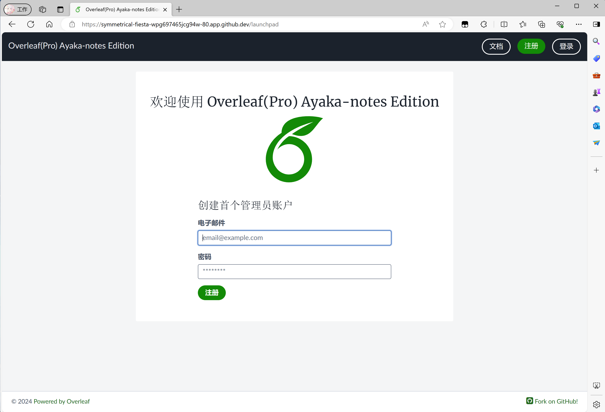

# Overleaf
Overleaf Pro Version, Include more functions.

## Latest News!

Git integration is under dev!(2024/04/09)


Git integration demo can use mock data to finish git clone!(2024/04/11)


## Quick Setup 
Run the following command to start in Github codespace.
```bash
# use test-codespace for github codespace!
# 2core 8G is enouth
cd test-codespace
# you need to wait for at least 3 mins. 
./init.sh
```

[](https://codespaces.new/ayaka-notes/overleaf)

And then, open `/launchpad` to create first admin account, like this:



Github Codespace Version include the following texlive:
- `ghcr.io/ayaka-notes/texlive-full:slim`

> [!WARNING]
> You can't use **Text Sync** if you use direct Codespace Port Forwarding. It is suggested that you launch your local vscode, use local Port Forwarding with URL like `127.0.0.1`.


## Some Patches


## How To Enable Docker Compile?
- modify `docker-compose.yml` file
- Pay attention to `/workspaces/overleaf/`, this is an **Absolute PATH**, which shoule be where your repo(ayaka-notes/overleaf) is located.
- Here I provide 3 texlive images, for more images, find at [Packages](https://github.com/orgs/ayaka-notes/packages/container/package/overleaf%2Ftexlive) of the repo

> Want to use your own Tex Live Image?
>
> Don't use your own image, since you should manage to set `www-data` user's GID/UID to 33, so that it can works with sharelatex container.

```yaml
      # 注意：COMPILE_TIMEOUT必须在所有数据初始化之前生效
      # 因为编译时间是和用户强相关的，每个用户有自己的编译时间限制
      # 如果你服务器运行很久了，需要手动写脚本，更新mongo数据库中的用户编译时间限制
      COMPILE_TIMEOUT: "600"
      DOCKER_RUNNER: "true"
      SANDBOXED_COMPILES: "true"
      SANDBOXED_COMPILES_SIBLING_CONTAINERS: "true"
      # 记得改/workspaces/overleaf为你的克隆下来的仓库的路径
      SANDBOXED_COMPILES_HOST_DIR: "/workspaces/overleaf/data/sharelatex_data/data/compiles"
      SYNCTEX_BIN_HOST_PATH: "/workspaces/overleaf/data/sharelatex_data/bin" 
      TEX_LIVE_DOCKER_IMAGE: "ghcr.io/ayaka-notes/overleaf/texlive:2023"
      ALL_TEX_LIVE_DOCKER_IMAGES: "ghcr.io/ayaka-notes/overleaf/texlive:2023,ghcr.io/ayaka-notes/overleaf/texlive:2022,ghcr.io/ayaka-notes/overleaf/texlive:2021"

```
