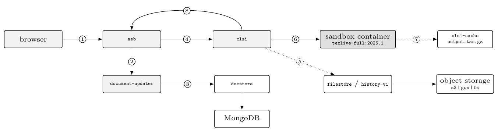
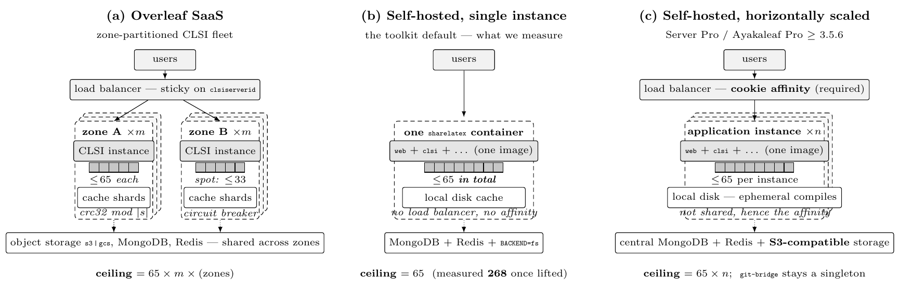
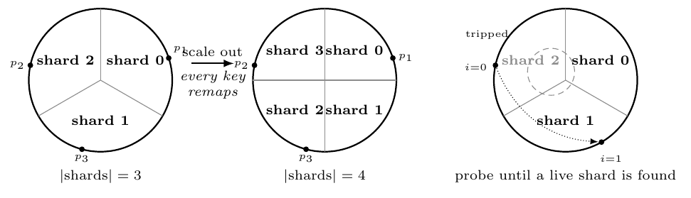
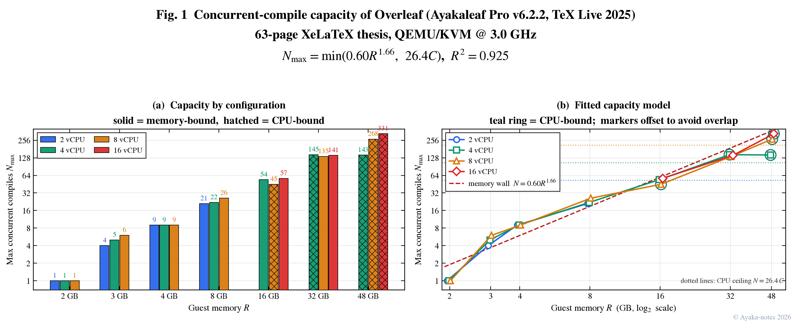
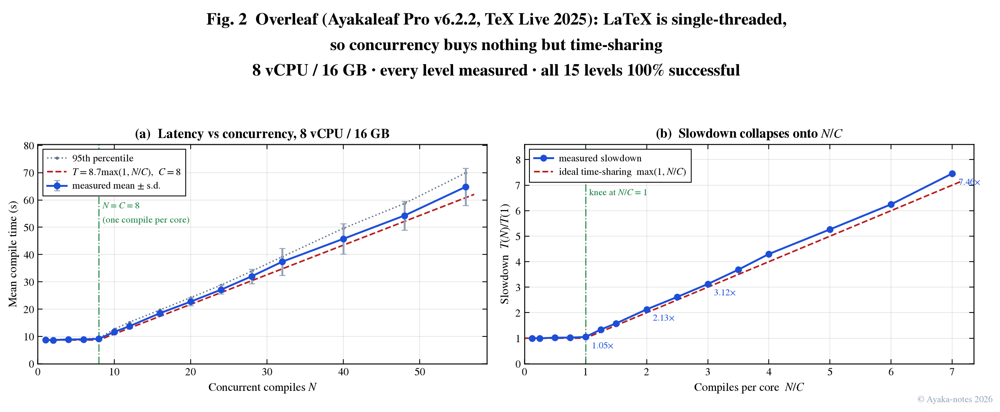
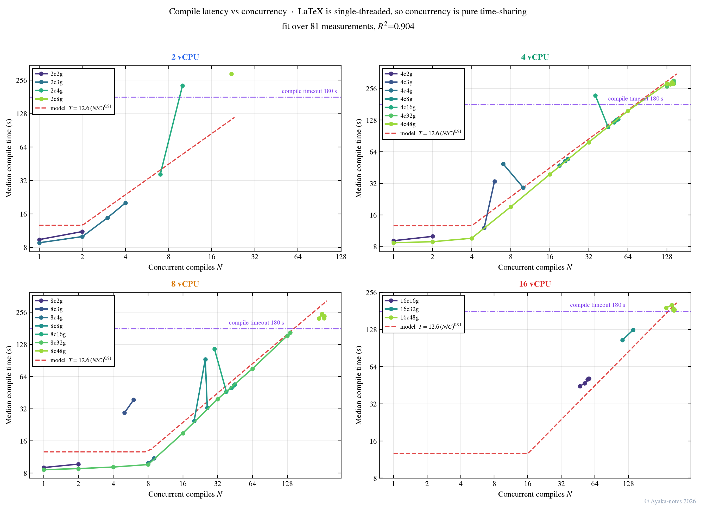
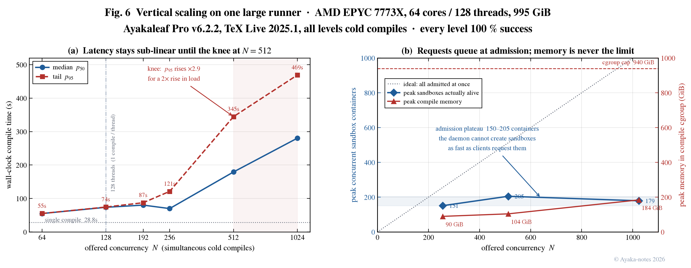
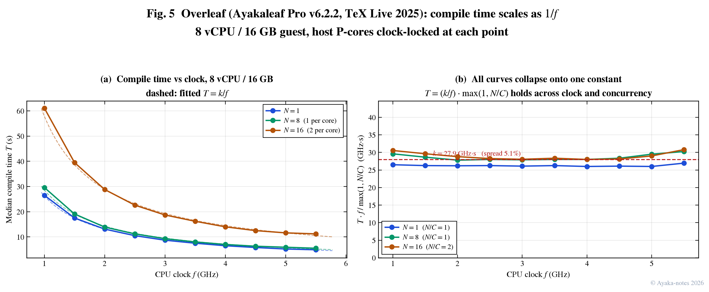
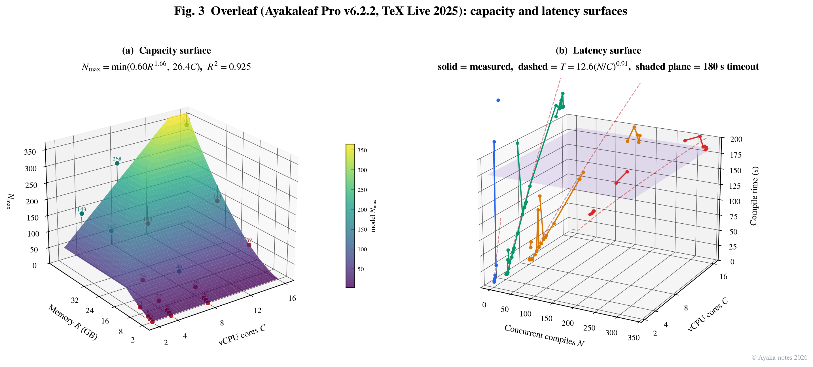
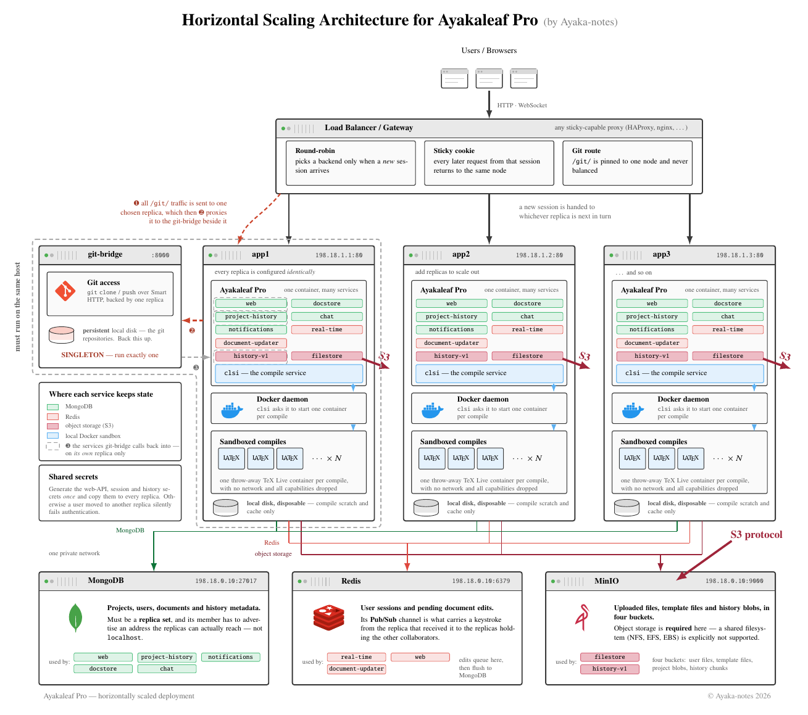

---
layout:
  width: default
  title:
    visible: true
  description:
    visible: true
  tableOfContents:
    visible: false
  outline:
    visible: true
  pagination:
    visible: false
  metadata:
    visible: false
  tags:
    visible: true
  actions:
    visible: true
tags:
  - performance
  - benchmark
  - latex
  - overleaf
  - scale
  - research
---

# Overleaf Benchmark: A Deep Research of Concurrent  Compilation in Overleaf (SaaS and Self-host)



## Abstract

Self-hosted Overleaf deployments are commonly sized with a single rule of thumb: one CPU core and one gigabyte of memory per five to ten concurrent users. We show that this rule is not merely imprecise but structurally wrong, because it assumes a single resource dimension governs capacity when in fact two independent walls do, and because two software parameters — neither of them hardware — dominate the outcome by factors of up to four.

We measure a stock Ayakaleaf Pro v6.2.2 deployment with sandboxed compilation (TeX Live 2025) across 21 CPU/memory configurations inside QEMU/KVM guests whose host cores are clock-locked at 3.0 GHz. The workload is a real 63-page XeLaTeX thesis compiled simultaneously by up to several hundred distinct user accounts. We find that below 32 GiB of guest memory, core count is almost irrelevant — at 16 GiB the measured capacity of 4, 8 and 16 vCPU guests differs by less than 8% — and that capacity is instead governed by a super-linear memory wall arising from shared page cache over the TeX Live tree.

To ask whether these laws survive an order-of-magnitude change of scale, we repeat the sweep on a single 64-core, 995 GiB server. It sustains 1024 simultaneous cold compiles at 100% success — eight times its thread count — and we never reach its ceiling. The useful number is not that ceiling but the knee below it: tail latency grows by 20–40% per doubling up to $$N=256$$, then by 190% at $$N=512$$. Capacity reported as “the largest concurrency that does not fail” would therefore overstate the usable operating point by a factor of four. On that machine memory is never the binding resource; the limit is CPU together with the rate at which the container daemon can admit new sandboxes, which saturates near 200 regardless of how many compiles are requested.

We further identify two implementation-level effects invisible to capacity planning. First, CLSI enforces a hard-coded ceiling of 65 simultaneous compiles that is not exposed through any environment variable; beyond it users receive HTTP 503 immediately rather than being queued. Second, the per-container memory limit in the Docker runner has been ineffective since its introduction in 2018, both by magnitude and by placement, so an out-of-memory event takes down the entire host rather than a single compile. Lifting the concurrency ceiling and raising the default compile timeout from 180 s to 300 s increases measured capacity of an 8 vCPU / 48 GiB guest from 64 to 268 concurrent compiles — a factor of 4.2 at zero hardware cost.

Finally, we show that concurrency in this system buys nothing but time-sharing, and that the workload is bounded by clock alone. A fitted degradation law $$T(N)=T_1\max(1,N/C)^{b}$$ yields $$b=0.914$$, close to perfect proportional slowdown, and a clock sweep over the machine’s full 1.0–5.5 GHz range collapses thirty measurements onto $$T=(k/f)\max(1,N/C)$$ with $$k=27.9 GHz·s$$ and a residual spread of 5.1%. A 5.5× clock buys a 5.5× speed-up with no diminishing return, which is the sense in which clock and cores buy different things: clock makes every user’s compile faster, cores only admit more users.

## 1. Introduction

Overleaf is the dominant collaborative LaTeX editor, and its on-premises distribution is widely deployed by universities and research groups that cannot send unpublished manuscripts to a third-party cloud. Sizing such a deployment is a recurring practical question: given a fixed hardware budget, how many people can actually press “Recompile” at the same time?

The official guidance is a linear rule — roughly one core and one gigabyte per five to ten concurrent users — which presumes that capacity scales smoothly and jointly in both resources. Our measurements contradict this in three ways.

### 1.1 Capacity is governed by two independent walls, not one

A configuration fails either because memory is exhausted, in which case the Overleaf stack itself dies and returns HTTP 502, or because compiles exceed the server-side timeout, in which case CLSI reports `timedout` while gigabytes of memory sit unused. These two regimes have entirely different scaling behaviour and different remedies. Adding cores to a memory-bound configuration is not merely inefficient, it is occasionally counterproductive: we measure configurations where increasing core count _reduces_ capacity, because more cores make concurrent compiles advance in lockstep so their peak memory demands coincide instead of interleaving.

### 1.2 Software parameters dominate hardware

The compile timeout is a per-user field in MongoDB whose default of 180 s silently caps CPU-bound configurations. Raising it to 300 s multiplies measured capacity by up to 4.2 on unchanged hardware. Independently, CLSI refuses more than 65 simultaneous compiles by a hard-coded constant. Any capacity study — and any deployment — that does not account for both is measuring the software, not the machine.

### 1.3 Concurrency is time-sharing, not parallelism

Because a LaTeX compile is single-threaded, serving $$N$$ simultaneous users on $$C$$ cores does not make the system finish sooner; it makes every user wait proportionally longer. The question “how many concurrent users are supported” is therefore ill-posed until one fixes how long a user is willing to wait. We make this dependency explicit and quantify it.

### 1.4 Contributions

* A capacity matrix over 21 CPU/memory configurations measured under clock-locked, repeat-verified conditions, with the binding constraint identified per configuration from its failure signature.
* Two fitted models: a capacity model separating a super-linear memory wall from a CPU ceiling, and a latency model establishing pure time-sharing behaviour.
* Identification and experimental confirmation of two implementation issues in the deployed system, including a container memory limit that has been inoperative since 2018.
* A quantification of the compile-timeout/capacity trade-off, which we argue must be stated alongside any concurrency figure.

## 2. Background

### 2.1 Compilation path

An Overleaf compile request travels `web` $$\rightarrow$$ `clsi` $$\rightarrow$$ a compile container. In a sandboxed-compiles deployment (`SIBLING_CONTAINERS_ENABLED=true`) CLSI does not run `latexmk` in-process; it asks the host Docker daemon, reachable through a bind-mounted socket, to start a fresh container from a TeX Live image with the project directory bind-mounted at `/compile`. One compile is therefore one short-lived container running one `latexmk` process.

Three consequences follow, and all three shape the measurements in this paper. First, the unit of work is a single-threaded process: XeLaTeX does not parallelise. Second, per-compile resource isolation is whatever the Docker runner requests — we show in §6.2 that it effectively requests nothing. Third, the working set is dominated not by the document but by the TeX Live tree, a read-only corpus of roughly 32 GiB that every concurrent compile reads from and therefore shares through the host page cache. This sharing is the origin of the super-linear memory scaling we observe.

### 2.2 Enabling sandboxed compiles

Community-edition Overleaf runs `latexmk` inside the application container itself. Ayakaleaf Pro, like Overleaf Server Pro, can instead run each compile in a _sibling_ container — a container started by the application on the _host’s_ Docker daemon rather than nested inside the application container. Two toolkit settings switch this on:

```ini
# config/overleaf.rc
SERVER_PRO=true
SIBLING_CONTAINERS_ENABLED=true
DOCKER_SOCKET_PATH=/var/run/docker.sock

# config/variables.env
TEX_LIVE_DOCKER_IMAGE=ghcr.io/ayaka-notes/texlive-full:2025.1
ALL_TEX_LIVE_DOCKER_IMAGES=ghcr.io/ayaka-notes/texlive-full:2025.1
```

The toolkit bind-mounts the host Docker socket into the application container and translates these into the environment CLSI reads: `SANDBOXED_COMPILES=true`, `SANDBOXED_COMPILES_SIBLING_CONTAINERS=true`, and `SANDBOXED_COMPILES_HOST_DIR`, the last of which is the _host_ path of the compile directory. That path matters: because the daemon starting the compile container is the host’s, the bind mount it is given must be resolvable in the host’s namespace, not the application container’s. Server-Pro’s `config/env.sh` additionally forces `TEXLIVE_IMAGE_USER=www-data` in this mode so that files written by the compile container are owned consistently.

Verification is direct: during a compile the host shows a container named `project-{projectId}-{userId}-{hash}` running `latexmk` from the TeX Live image, exiting 0. This is the unit whose multiplicity we measure throughout the paper, and whose complete absence of resource limits we report in §6.2.

**Why this matters for the study.**

Sibling containers make the measurement clean — each compile is an observable, independently scheduled OS entity — but they also mean the guest kernel, not Overleaf, arbitrates CPU and memory between compiles. Every scaling law in this paper is therefore a property of the Linux scheduler applied to $$N$$ single-threaded processes, which is why it is so regular.

<figure><figcaption></figcaption></figure>

**Figure 1.** One compile request, traced through the community-edition microservices. The split at steps and matters for capacity: document text is copied into the request body, while binary assets are passed by reference and pulled by `clsi`. Neither dominates — a project’s compile cost is set by the 32 GiB TeX Live tree that every concurrent compile reads through the shared page cache.

<figure><figcaption></figcaption></figure>

**Figure 2.** Three deployment topologies and where the per-instance compile ceiling lands in each; stacked panels denote replication. The 65-compile constant guards _one_ CLSI, so the SaaS fleet multiplies it by instances and zones (a), and the horizontal scaling supported by Server Pro and Ayakaleaf Pro multiplies it by instances (c) — at the cost of central MongoDB, Redis and S3-compatible storage, a load balancer with cookie session affinity (compile output is written to instance-local disk, so a compile and its subsequent PDF download must land on the same instance), and a singleton `git-bridge`. The toolkit default (b), which is what we measure, has a multiplier of one, so a constant sized for one member of a fleet becomes the ceiling of the entire installation.

<figure><figcaption></figcaption></figure>

**Figure 3.** Shard selection in `clsi-cache`. A project is mapped by $$\operatorname{crc32}(\text{projectId}\text{-}i)\bmod|\text{shards}|$$, i.e. the hash space is cut into as many equal sectors as there are shards. This is _modulo_ hashing, not ring-based consistent hashing: growing the fleet from three shards to four repartitions the entire space and remaps essentially every project (a, b). That is precisely why the implementation needs an explicit online resharding ramp, moving a linearly growing fraction of projects from `currentShards` to `desiredShards` over a time window, rather than the $$K/n$$ movement a consistent-hashing ring would give. When a shard’s circuit breaker is tripped, the salt $$i$$ is incremented and the shard removed from the candidate list, so the lookup probes onwards instead of failing (c).

### 2.3 The two failure modes

Every configuration we measured fails in exactly one of two ways, and the distinction is visible in the response status rather than inferred:

* **Memory exhaustion** — the Overleaf stack itself becomes unresponsive and the request returns **HTTP 502**. Available guest memory at the failing level is typically below 500 MiB.
* **Compile timeout** — CLSI terminates the compile at the per-user timeout and reports status `timedout`. Available memory at the failing level is often several gigabytes.

We classify each configuration by this signature rather than by a heuristic on resource ratios, which makes the “which wall did we hit” question answerable from the data itself.

## 3. Methodology

### 3.1 Testbed and clock control

All guests run under QEMU/KVM on a single Intel Core i9-14900K host with 62 GiB of RAM and NVMe storage. The guest is Ubuntu 24.04 with Docker 29.7 and the Overleaf Toolkit deploying Ayakaleaf Pro v6.2.2 with sandboxed compiles against `texlive-full:2025.1`.

A commodity desktop CPU is a poor proxy for a server unless its clock is controlled. KVM offers no mechanism to set a virtual clock: a vCPU is a host thread and runs at whatever frequency the host core runs at. We therefore constrain the host directly, disabling turbo and pinning `scaling_max_freq` to 3.0 GHz on every core, and pin the guest’s vCPUs to physical P-cores with `taskset`. The distinction matters on a hybrid-core CPU: the E-cores of this part have a base clock of 2.4 GHz and _cannot_ reach 3.0 GHz once turbo is disabled, so a run that strays onto them silently measures a slower machine. Under full load we verify 3000 MHz exactly on all sixteen pinned threads. A guard script asserts this invariant before every benchmark and refuses to start otherwise; it caught one silent reset of the governor during the study.

### 3.2 A second testbed: one large runner

The QEMU matrix isolates one variable at a time, but it caps out at sixteen pinned threads. To ask whether the same laws still hold an order of magnitude higher, we repeated the concurrency sweep on a single large server: one AMD EPYC 7773X (Milan-X, 64 cores / 128 threads, 768 MiB of L3) with 995 GiB of RAM, running the same Ayakaleaf Pro v6.2.2 image against the same `texlive-full:2025.1`. Unlike the QEMU guests this machine is not clock-pinned: it is a production-class server and we measure it as one.

Two operational precautions were necessary and are worth stating, because without them the experiment measures the harness rather than the server. First, every container was confined to a `systemd` slice with `MemoryMax=940 GiB`, so that a runaway sweep exhausts a cgroup rather than the host. Second, sandboxed compiles are created by the host daemon and each dirties its own copy-on-write layer — measured at 116 MiB per container even though the 20.6 GiB base image is shared — so the Docker data root was moved to a dedicated NVMe device. A sweep at $$N=1024$$ writes roughly 119 GiB of scratch layers, which does not fit on a stock root filesystem.

### 3.3 Workload

The document is a real 63-page master’s thesis (SJTU template) compiled with XeLaTeX via `latexmk`, containing TikZ figures, `biblatex` bibliography processing, and embedded PDF assets — that is, a realistic rather than synthetic load. A single compile on an unloaded guest takes 8.6–9.8 s across all configurations, which we use as the free-flight baseline $$T_1$$.

### 3.4 Load generation

We create 512 real user accounts and give each its own copy of the project, so that concurrent compiles contend exactly as independent users would rather than sharing a project lock. Requests are issued from the host against the guest’s forwarded port, so that load generation consumes no guest CPU.

Concurrency is _simultaneous_, not staggered. Every session is established first — login, CSRF token, compiler selection — and only then does each thread sleep until a common wall-clock instant, computed once and shared, before issuing its `POST /project/:id/compile`. The distinction is not pedantic. A staggered ramp measures throughput under a stable queue; a simultaneous burst measures what happens when a lecture hall of students presses the same button after the same deadline announcement, which is the case operators actually fear. The two differ by more than a constant factor, because the second populates the compile queue faster than the daemon can drain it.

Four practical obstacles had to be removed before that burst could be delivered faithfully. Each is worth recording, because each silently degrades the experiment into a measurement of the harness rather than of the server.

#### 3.4.1 Two rate limiters, not one

Overleaf throttles logins per source address — 20 attempts per minute — and all of our traffic originates from a single host. Assigning each simulated user a distinct `X-Forwarded-For` address removes that limit but immediately runs into a second, coarser one: a per-subnet budget of roughly 200 per minute. Spreading users across a contiguous block therefore fails at the 201st account. We instead derive the synthetic address from the user index so that consecutive users land in different `/24`s,

$$
\texttt{203.}\;\big\lfloor i/250 \big\rfloor \bmod 100 + 1\texttt{.}\;
  i \bmod 250 + 1\texttt{.}\; i \bmod 200 + 10 ,
$$

which keeps both limiters slack for the full population of 1024.

#### 3.4.2 The injected header is discarded by default

Setting the header is not sufficient. Express only honours `X-Forwarded-For` for peers it has been told to trust, and Overleaf’s `trustedProxyIps` defaults to `loopback`. Because the load generator reaches the application through the container’s bridge rather than over the loopback interface, the header is parsed and then thrown away, and every simulated user collapses back onto one address. The symptom is a wave of `HTTP 429` at exactly the twentieth login, which is easy to misread as server overload. The gateway network must be added to the trust chain explicitly; in the clustered deployment of §4.3 the pod and service CIDRs must be added as well.

#### 3.4.3 A load balancer will overwrite the header it was asked to preserve

When the instance sits behind a proxy, the conventional `option forwardfor` _appends_ the real client address to the chain, which is the correct behaviour for production and precisely wrong here: the synthetic address is displaced by the load generator’s own. The directive must be qualified as `option forwardfor if-none`, so the proxy adds a value only when the client supplied none.

#### 3.4.4 The client runs out of file descriptors before the server runs out of capacity

At $$N=1024$$ the generator holds more than a thousand simultaneous sockets, and the default soft limit of 1024 descriptors is reached during session setup rather than during the measurement. The failure is quiet: three sessions fail to establish and the run reports 1021 rather than 1024, while a sampling thread that shells out for container counts dies with `EMFILE` and silently truncates the telemetry. The soft limit must be raised on the generator — the hard limit on our host was already 1048576 — and the run repeated. We report both runs in §4.3: the corrected one completes 1024 of 1024 with a median within 1.2 s of the truncated one, which is why we treat the first as usable but not authoritative.

### 3.5 Measurement protocol

Several methodological choices proved necessary for reproducibility.

#### 3.5.1 Warm-up

On a freshly booted guest the page cache is empty and the first compiles measure cold-start I/O rather than steady-state capacity: the same 2 vCPU / 2 GiB configuration yields 36.5 s cold and 9.8 s warm, a factor of 3.7. Each configuration therefore performs two discarded single-compile warm-ups after boot.

#### 3.5.2 Pass criterion

A concurrency level passes only if _every_ compile succeeds and the level survives a repeat. This is stricter than a success-rate threshold and it matters: at 4 vCPU / 16 GiB a level of 32 passed once at 80.2 s median and then timed out on all 32 compiles when repeated, so we report 31.

#### 3.5.3 Search

Levels are located by exponential bracketing from a model-predicted seed followed by exact integer bisection. Since the criterion is all-or-nothing, a level is settled by its first failure, so we abandon the remaining in-flight requests once one fails — except at small levels, where the abandoned compiles pin a small guest badly enough that it never recovers.

#### 3.5.4 Isolation between levels

Compile containers are drained, and the web application is polled until it answers again, before the next level starts. Without this a level following a crash records a spurious zero-session failure.

#### 3.5.5 Host hygiene

Unrelated virtual machines on the host were shut down: with 24 GiB of host memory committed elsewhere, the same guest configuration reported a load average of 11.7 instead of 3.2 at identical concurrency. Host memory pressure propagates into the guest and invalidates the measurement.

## 4. Results

### 4.1 The capacity matrix

Table 1 and Figure 4 give the measured ceiling for every configuration. Reading it across a row is the first surprise. At 4 GiB the 2, 4 and 8 vCPU guests all reach exactly 9 — quadrupling the cores changes nothing at all. At 16 GiB they reach 54, 45 and 57: going from 4 to 16 cores buys 6%, and the 8-core guest is actually _worse_ than the 4-core one (§5.2). Only at 48 GiB does core count separate the configurations decisively: 143, 268 and 331.

<figure><figcaption></figcaption></figure>

**Figure 4.** Measured capacity across the configuration matrix. (a) Every configuration as a bar, grouped by memory and coloured by core count; solid bars are memory-bound (the guest dies with memory exhausted) and hatched bars are CPU-bound (compiles time out with memory to spare). Reading a group left to right shows how little core count buys below 16 GiB; reading across groups shows the super-linear return on memory. (b) The same points against the fitted model $$N_{\max}=\min(0.69R^{1.60},\,26.4C)$$; the dashed line is the memory wall and the dotted horizontals are the per-core-count CPU ceilings. A configuration is bound by whichever of the two it meets first.

Reading down a column is the second: at fixed cores, capacity grows super-linearly with memory, roughly as $$R^{1.6}$$, for the page-cache reason developed in §5.1.

| memory | 2 vCPU |  4 vCPU |  8 vCPU | 16 vCPU |
| -----: | -----: | ------: | ------: | ------: |
|  2 GiB |      1 |       1 |       1 |       — |
|  3 GiB |      4 |       5 |       6 |       — |
|  4 GiB |      9 |       9 |       9 |       — |
|  8 GiB |     21 |      22 |      26 |       — |
| 16 GiB |      — |      54 |  **45** |      57 |
| 32 GiB |      — | **145** |     135 |     141 |
| 48 GiB |      — | **143** | **268** | **331** |

**Table 1.** Maximum simultaneous compiles that complete successfully, measured at a 300 s compile timeout with the CLSI concurrency ceiling lifted. **Bold** marks a CPU-bound configuration (compiles time out with memory to spare); the rest are memory-bound (the stack dies with HTTP 502). The 2 GiB row carries the correction discussed in §5.2.

### 4.2 Concurrency is time-sharing

Figure 5 sweeps every concurrency level on a fixed 8 vCPU / 16 GiB guest. Two regimes are separated by a sharp knee at exactly one compile per core. Below it, mean compile time is flat — it moves from 8.7 s at $$N=1$$ to 9.1 s at $$N=C=8$$, a change of 5%. Above it, time grows in strict proportion to $$N/C$$: at $$N=16,24$$ we measure 18.5 s and 27.1 s, i.e. a ratio of $$1:2.13:3.12$$ against an ideal $$1:2:3$$.

<figure><figcaption></figcaption></figure>

**Figure 5.** Compile latency against concurrency at fixed hardware. The knee is at $$N=C$$; beyond it the measured slowdown tracks $$N/C$$ to within 5–7%. All fifteen levels succeeded completely.

<figure><figcaption></figcaption></figure>

**Figure 6.** Compile latency against concurrency for several configurations. Each panel holds the hardware fixed and sweeps the offered load; the vertical rule marks $$N=C$$. The curves are flat to the left of it and linear in $$N/C$$ to the right, which is the signature of time-sharing rather than of contention: the work does not become more expensive, it merely waits its turn.

Fitting $$T(N)=T_1\max(1,N/C)^{b}$$ over all successful measurements in the study gives $$b=0.914$$ ($$R^2_{\log}=0.904$$, $$n=81$$). An exponent indistinguishable from unity is the quantitative statement that a compile is a single-threaded, CPU-bound unit of work and that concurrency neither helps nor hurts beyond dividing the cores. The practical corollary is uncomfortable for capacity planning: a configuration can absorb an arbitrary number of users without _failing_ while making every one of them wait proportionally longer. At $$N=56$$ on this guest all compiles still succeed, but each user waits 64.8 s instead of 8.7 s.

### 4.3 Vertical scaling to 1024 concurrent compiles

Table 2 and Figure 7 report the sweep on the large runner. Every level is a _cold_ compile: before each level we clear the compile directory and the CLSI cache of every participating project via `DELETE /project/:id/output`, so no level benefits from work done by the level below it. The single-compile baseline on this machine is 28.8 s, which is the cold figure and should not be compared against the 8.6–9.8 s steady-state baseline used earlier; the cold baseline on the QEMU guests is 28.3 s, so per-thread the two machines are within two percent of each other for this workload.

| $$N$$ |   success | $$p_{50}$$ | $$p_{95}$$ | $$p_{50}/T_1$$ | peak ctrs |
| ----: | --------: | ---------: | ---------: | -------------: | --------: |
|    64 |     64/64 |     55.0 s |     55.1 s |           1.9× |         — |
|   128 |   128/128 |     73.6 s |     74.4 s |           2.6× |         — |
|   192 |   192/192 |     80.2 s |     87.3 s |           2.8× |         — |
|   256 |   256/256 |     69.8 s |    121.2 s |           2.4× |       151 |
|   512 |   512/512 |    179.2 s |    344.6 s |           6.2× |       205 |
|  1024 | 1024/1024 |    280.2 s |    468.9 s |           9.7× |       179 |

**Table 2.** Concurrency sweep on one EPYC 7773X (64 cores / 128 threads, 995 GiB). All levels cold; baseline 28.8 s. Peak containers is the maximum number of sandboxes alive simultaneously.

<figure><figcaption></figcaption></figure>

**Figure 7.** Vertical scaling on one large runner. (a) Latency against offered concurrency; the shaded region marks the regime past the knee. (b) The number of sandboxes actually alive never tracks the number requested — it saturates near 200 — while the compile cgroup never uses more than a fifth of its cap.

#### 4.3.1 The machine never fails

Every level completes at 100%, including $$N=1024$$ — eight times the thread count. We did not find this machine’s capacity ceiling; we ran out of patience before it ran out of headroom. This is the first configuration in the study where the binding constraint is not memory: at $$N=1024$$ the compile cgroup peaks at 184 GiB, one fifth of its 940 GiB cap, while the CPU sits at 100% utilisation with a load average of 166.

#### 4.3.2 Degradation is sub-linear because admission is rate-limited

Naive time-sharing predicts that $$8\times$$ the threads costs $$8\times$$ the latency. The measured cost is $$9.7\times$$ relative to a single compile, but only $$3.8\times$$ relative to $$N=128$$ — for an eightfold increase in offered load. The reason is visible in Figure 7(b) and in the last column of Table 2: although 1024 requests are issued simultaneously, the number of sandboxes actually alive never exceeds 205. The daemon cannot create containers as fast as the clients ask, so requests queue at admission instead of contending inside the CPU. Queueing is what saves the tail here, and it does so accidentally.

#### 4.3.3 The knee is at 512, not at the failure point

Between $$N=256$$ and $$N=512$$ the $$p_{95}$$ latency rises by $$2.9\times$$ for a doubling of load; every earlier doubling cost between $$1.2\times$$ and $$1.4\times$$. Capacity stated as “the largest $$N$$ that does not fail” would report 1024 and be useless to an operator: at that point the tail wait is nearly eight minutes.

### 4.4 Compile time is inversely proportional to clock

Since the workload is CPU-bound, its cost should scale as $$1/f$$. We test this directly by sweeping the host clock across the machine’s entire range, 1.0–5.5 GHz in ten steps, on an otherwise unchanged guest (Figure 8). Single-compile time moves from 26.5 s to 4.8 s: a 5.5× clock buys a 5.5× speed-up with no diminishing return anywhere in the range. The product $$T\!\cdot\!f$$ is constant to within 2% across all ten clocks.

Normalising by the core share collapses all thirty measurements — three concurrency levels at ten clocks — onto a single constant:

$$
T(N,f) \;=\; \frac{k}{f}\,\max\!\left(1,\frac{N}{C}\right),
  \qquad k = 27.9 GHz·s,
  \label{eq:combined}
$$

with a residual spread of 5.1% over a range in which the clock itself varies by 5.5×. The absence of any curvature is itself the result: had the workload been memory-bandwidth- or I/O-bound, $$T$$ would flatten at high clock as the CPU outran the other resource.

<figure><figcaption></figcaption></figure>

**Figure 8.** Clock sweep. (a) $$T=k/f$$ with the fitted hyperbola. (b) After dividing by $$\max(1,N/C)$$ all points collapse onto one constant, confirming Equation (1).

Equation (1) has a direct procurement consequence that is easy to state and easy to get wrong: _clock improves the experience of every individual user, core count only admits more of them_. A machine with a 20% higher clock compiles 20% faster for everybody, with no diminishing return; twice the cores make nobody’s compile faster at all.

## 5. Analysis

### 5.1 Two walls, fitted separately

Each configuration is classified by its failure signature (§2.3), and the memory wall and CPU ceiling are then fitted only on the configurations that actually hit them:

$$
N_{\max} = \min\left(A R^{p},\; k_c C\right)
$$

with $$R$$ in gibibytes and $$C$$ in vCPUs.

The memory-wall exponent is consistently super-linear, $$p>1$$: the marginal memory cost of one additional concurrent compile _falls_ as total memory grows, from roughly 312 MiB per compile on a 3 GiB guest to about 194 MiB on a 32 GiB one. The mechanism is the shared page cache over the TeX Live tree described in §2.1: concurrent compiles read overlapping font and macro files, so a larger cache is amortised over more of them. This is why the naive “one gigabyte per five users” rule under-predicts large machines and over-predicts small ones.

<figure><figcaption></figcaption></figure>

**Figure 9.** The same data as two surfaces over the $$(C,R)$$ plane. (a) Capacity: the fitted surface is a ridge, not a plane — it climbs steeply with memory and is nearly flat along the core axis until memory stops binding, which is why the 48 GiB row is the only one where core count separates the configurations. (b) Latency against concurrency for every configuration, with the fitted $$T=12.6\,(N/C)^{0.91}$$ shown dashed and the 180 s timeout drawn as a plane. A configuration fails where its solid curve pierces that plane, which makes visible how directly the timeout setting determines the reported capacity.

### 5.2 Where more cores make things worse

Equation (2) is a minimum of two terms and therefore monotone in $$C$$, but the measurements are not. We observe two inversions in which adding cores _reduced_ capacity: at 16 GiB (54 vs. 45) and at 32 GiB (145 vs. 135). Both occur in the memory-bound regime, and the mechanism is the same in each: with more cores, concurrent compiles advance in lockstep and reach their peak resident size at the same moment, whereas with fewer cores the scheduler interleaves them and the peaks are staggered. On a guest whose memory headroom is already marginal, staggering is what keeps it alive. A capacity model built on average resource use cannot express this; it is a property of the _coincidence_ of peaks.

A third apparent inversion, at 2 GiB, we now discount. The search records capacity 2 at 2 vCPU but 1 at 4 and 8 vCPU, which reads as the same effect. Re-examining the raw sweeps shows something simpler: at 2 GiB the level $$N=2$$ succeeded on first attempt at all three core counts and then failed its confirmation run at two of the three. The level is not a capacity but a coin flip, and the 2 vCPU entry is the toss that happened to land. We therefore report the reproducible value, 1, at all three core counts and draw no conclusion from the difference. We record the correction here rather than silently restating the table, because the discarded reading is the kind that would have supported an interesting claim.

## 6. Implementation findings

### 6.1 A hard-coded concurrency ceiling

On sufficiently large guests, capacity stopped at exactly 65 simultaneous compiles regardless of requested concurrency: at $$N=66,80,96,128$$ we measured $$65$$ successes and $$1,15,31,63$$ immediate `unavailable` responses, with the container count pinned at 65, several gigabytes of memory unused, and median compile time steady at 77 s — far below any timeout.

The cause is a constant in CLSI:

```javascript
// services/clsi/config/settings.defaults.cjs:110
compileConcurrencyLimit: isSpotInstance ? 32 : 64,

// services/clsi/app/js/LockManager.js
if (LOCKS.size <= Settings.compileConcurrencyLimit) return   // <= admits 64+1
throw new Errors.TooManyCompileRequestsError(...)
```

The comparison is non-strict, so the effective ceiling is $$64+1=65$$, matching the measurement exactly. The excess requests receive **HTTP 503** — they are _rejected_, not queued, so from the user’s side the compile button simply fails. Unlike every other tunable in the same file, this one reads no environment variable; it was introduced upstream in August 2024 and can only be changed by modifying the image. With the limit raised, the same 16 vCPU / 32 GiB guest that reported `success=65, unavailable=15` at $$N=80$$ instead reported `success=80`.

### 6.2 An inoperative container memory limit

Inspecting a live compile container shows no resource isolation whatsoever:

```
Memory=0  NanoCpus=0  CpuShares=0  CpuQuota=0  CpusetCpus=[]
Ulimits=[{Name:cpu Soft:305 Hard:310}]
```

The absence of any CPU quota is by design and explains why the time-sharing exponent of §4.2 is so clean: nothing distorts the competition between compiles. The absence of a _memory_ limit, however, is not by design. The Docker runner does request one:

```javascript
// services/clsi/app/js/DockerRunner.mjs:262
Memory: 1024 * 1024 * 1024 * 1024, // 1 Gb
```

This is wrong twice over. The value is $$1024^4=1 tebiB$$ where the comment intends $$1024^3$$; and the field is placed at the top level of the create options rather than inside `HostConfig`, where the Docker API expects it, so it is discarded — which the observed `Memory=0` confirms. Both errors are present in the commit that introduced the file (`9a519f0d3d`, March 2018) and survived conversion from CoffeeScript, a repository-wide reformat, and a CJS-to-ESM migration, none of which revisit semantics. Notably `MAX_OUTPUT = 1024 * 1024 // 1MB` in the same commit is correct, indicating a slip rather than a misunderstanding.

The consequence is visible in our low-memory measurements. Because compiles are unbounded, memory exhaustion does not manifest as Docker terminating one offending container; it takes down the whole guest. On the 2 vCPU / 2 GiB configuration we observed the monitoring SSH session blocked for 300 s, a load average of 68 on two cores, and the guest ultimately rebooting itself. A functioning per-container limit would degrade far more gracefully: the over-large compile would fail and the service would survive.

The one limit that does take effect is `RLIMIT_CPU`, set to $$\text{timeout}+5$$ seconds. It bounds _CPU_ time, not wall-clock time, and a single compile consumes only about 9 s of CPU, so it never binds at any concurrency; it guards against pathological input such as a runaway macro. It is, however, a useful oracle: observing `Soft:305` confirms that a 300 s timeout setting has actually propagated to the container.

### 6.3 The compile timeout is the dominant tunable

The per-user field `features.compileTimeout` defaults to 180 s. For any CPU-bound configuration this is not a safety margin but a capacity setting, because a machine that is still computing correctly is declared failed. Raising it to 300 s — a single MongoDB update — changes measured capacity by up to a factor of 4.2 (Table 3). The ceiling is 600 s, enforced by `RequestParser.MAX_TIMEOUT`, above which the value is silently truncated.

| Configuration    | 180 s | 300 s |          Ratio | Binding constraint    |
| ---------------- | ----: | ----: | -------------: | --------------------- |
| 8 vCPU / 48 GiB  |    64 |   268 | $$4.19\times$$ | CPU, 28 GiB free      |
| 4 vCPU / 32 GiB  |    47 |   145 | $$3.09\times$$ | CPU, 30 GiB free      |
| 4 vCPU / 48 GiB  |    63 |   143 | $$2.27\times$$ | CPU                   |
| 4 vCPU / 16 GiB  |    31 |    54 | $$1.74\times$$ | CPU                   |
| 2 vCPU / 8 GiB   |    15 |    21 | $$1.40\times$$ | CPU                   |
| 8 vCPU / 32 GiB  |   127 |   135 | $$1.06\times$$ | hits memory wall next |
| 8 vCPU / 16 GiB  |    56 |    45 | $$0.80\times$$ | memory                |
| 16 vCPU / 32 GiB |   159 |   141 | $$0.89\times$$ | memory                |

**Table 3.** Effect of the compile timeout on measured capacity.

The last two rows are the counter-intuitive half of the result and the reason we re-measured every configuration under one timeout. For _memory_-bound configurations a longer timeout _reduces_ capacity, because each compile holds its resident set for longer and more of them overlap. A capacity figure is therefore meaningless without stating the timeout it was measured under, and the two cannot be mixed within one table.

## 7. Related work

### 7.1 Vendor guidance

Overleaf’s own hardware documentation states the qualitative facts we quantify here: that LaTeX is single-threaded, that single-core performance therefore governs compile time, and that “more cores will only help if you are trying to compile more documents than you have free CPU cores” \[1]. It then gives the linear sizing rule — a 2 core/3 GiB base plus one core and one gigabyte per five to ten concurrent users — that motivated this study. Our contribution is to turn these statements into measured laws (Equations (1) and (2)), and to show where the linear rule breaks: it has no term for the shared page cache that makes the memory wall super-linear, and no term for the two software parameters that dominate the result.

### 7.2 Build and CI capacity studies

Measurement of build systems under concurrency is well established outside the LaTeX setting. LightSys reports that conventional CI systems compiling inside Docker containers degrade in I/O as pull-request arrival rate rises, with a bottleneck appearing around eleven concurrent requests \[17]; TAOS-CI observes that compilation dominates CI wall-clock time, accounting for 60–67% of total pipeline duration on large projects \[18]. Our system differs in one respect that turns out to be decisive: a LaTeX compile is interactive. A CI job that takes twice as long is an inconvenience; a compile that takes twice as long is observed directly by a user waiting on a preview pane, which is why we treat the timeout not as a failure threshold but as a capacity parameter.

### 7.3 Container overheads

Recent work decomposes Docker container startup latency across storage tiers \[19] and characterises container performance at the edge \[20]. In our setting per-compile container startup is amortised: it is a small constant relative to a 9 s compile, and the free-flight time $$T_1$$ we fit absorbs it. The container property that does matter is the _absence_ of resource limits (§6.2), which converts a per-compile memory overrun into a whole-host failure.

### 7.4 LaTeX as untrusted input

Sandboxed compilation exists because TeX is a programming language and documents are untrusted input \[21, 22]. That design choice is what makes this study possible — each compile is an isolated container with observable resource behaviour — and also what makes the missing memory limit consequential, since isolation is assumed by operators who deploy it.

### 7.5 The compiler as an object of study

TeX itself is well documented as a language \[16], but its behaviour as a _build target_ has attracted attention only recently. Tan and Rigger \[8] compile a large corpus of arXiv sources across engines and distribution versions and find that engine choice is not substitutable: only a fraction of a percent of documents produce byte-identical output under XeTeX and pdfTeX. That result bears directly on our methodology. Capacity is a property of a document _and_ an engine, so a benchmark that does not fix both is not reproducible; we therefore pin one document, one engine, and one distribution (`texlive-full:2025.1`) throughout, and we report the engine in every figure caption. It also bounds the generality of our numbers in a way worth stating plainly: they characterise XeLaTeX on this document, not TeX in the abstract.

Work on LaTeX build _systems_ is largely practitioner-driven. The LaTeX3 project’s `l3build` \[13] standardises regression testing and packaging, and independent benchmarks compare wrapper tools — a survey of 26 build systems finds a precompiled preamble worth roughly 20% over a plain run and 40% over `latexmk` \[14]. These optimise the _single_ compile. They are orthogonal to, and compose with, what we measure: a preamble cache shortens $$T_1$$, and every capacity figure in this paper scales with $$T_1$$.

### 7.6 Concurrency control in the editor, not the compiler

The collaborative half of Overleaf rests on a well-established line of work. Operational transformation originates with Ellis and Gibbs \[9] and was made practical for high-latency clients by the Jupiter system \[10], whose design is recognisable in `document-updater`: a server that orders operations and a per-document buffer that clients synchronise against. Conflict-free replicated data types \[11] solve the same problem without a central sequencer. This distinction is what makes §4.3’s topology work at all: because the pending-update buffer lives in shared Redis rather than in an instance’s memory, a compile routed to any replica observes the latest keystrokes, and compile affinity can be chosen for cache locality rather than for correctness.

### 7.7 Capacity models

Amdahl’s law \[24] bounds speedup from parallelism and Little’s law \[23] relates occupancy to arrival rate and service time; both are used above. Gunther’s universal scalability law \[12] extends the first with a retrograde term for coherency delay, predicting that throughput peaks and then declines. We note that our system does _not_ exhibit that retrograde regime up to $$N=1024$$: throughput saturates and latency grows, but nothing collapses. The reason is structural rather than fortunate — compiles share no state to keep coherent, so the term the law adds is close to zero, and the admission plateau of §4.3 caps contention before it can matter.

## 8. Recommendations for operators



## Fix the two software parameters before buying hardware

Both are free and both are worth more than any single hardware upgrade we measured. Raise `features.compileTimeout` to a value your users will actually tolerate — the maximum CLSI accepts is 600 s — and, if you expect to exceed 65 simultaneous compiles, either lift `compileConcurrencyLimit` in a derived image or scale out. Doing neither means paying for cores that the software refuses to use.



## Size one machine by its knee, not by its ceiling

The large-runner sweep (§4.3) separates two numbers that are routinely conflated. The _ceiling_ — the largest concurrency that still returns every PDF — is at least 1024 on a 64-core server, and we never reached it. The _knee_ — the point beyond which the tail latency stops growing gently and starts doubling — is at 512, and the last comfortable operating point below it is 256. Between $$N=256$$ and $$N=512$$ the $$p_{95}$$ wait goes from two minutes to nearly six; between 512 and 1024 it reaches eight. An operator who sizes to the ceiling ships a system that technically works and that nobody wants to use.

For this machine and this document the recommended operating point is therefore **256 concurrent compiles**, which is $$4\times$$ the physical core count and $$2\times$$ the thread count, and which holds $$p_{95}$$ near 120 s. We suggest setting `compileConcurrencyLimit` to that value rather than leaving it high: admitting 1024 compiles at once makes everybody wait eight minutes, whereas admitting 256 and queueing the rest serves most users in two. Queueing degrades the late arrivals; contention degrades everyone.



## Treat these as worst-case numbers

Every level in Table 2 is a cold compile fired simultaneously. Neither condition holds in production: a warm compile of the same document takes 8.6 s against 28.3 s cold, a factor of $$3.3$$, and real users do not press the button on the same second. A steady-state population that recompiles every two minutes with a typical cache hit rate will therefore sustain considerably more writers than the concurrency number alone suggests — on the order of a thousand or more active authors at the 256 operating point. The concurrency figure is a bound on the instantaneous burst, not a seat count.



## Decide the latency budget first, then read off the size

Equation (1) inverts directly. For a target wait $$T$$ at clock $$f$$ on $$C$$ cores, the concurrency that fits is $$N \le C\,fT/k$$ with $$k\approx28 GHz·s$$ for this document. A 60 s budget on 8 cores at 3 GHz gives $$N\le51$$; a 120 s budget doubles it. Publishing the budget alongside the capacity is the only honest way to state either.



## Buy memory first, then cores, and check which wall you are on

Below 32 GiB we measured almost no benefit from additional cores. The diagnostic is cheap: if failures appear as HTTP 502 with the guest short of memory, add memory; if they appear as `timedout` with memory to spare, add cores or raise the timeout. Operators can read this off the same failure signature we used to classify configurations.



## Prefer clock for experience, cores for population

Because $$T\propto 1/f$$ holds without curvature (2% across 1.0–5.5 GHz), a faster clock makes every compile faster for every user. More cores make no individual compile faster; they only admit more concurrent ones. Deployments whose complaint is “compiles are slow” should buy clock; deployments whose complaint is “compiles fail at deadline” should buy memory and cores.



## Scale out rather than up past the ceiling

Beyond 65 concurrent compiles the supported path is horizontal scaling (Figures 2c and 10, elaborated in §9): multiple application instances behind a load balancer with cookie session affinity, sharing central MongoDB, Redis and S3-compatible storage, with `git-bridge` left as a singleton. This multiplies the per-instance ceiling by the instance count, which is exactly how the SaaS deployment reaches its own capacity.



## Do not rely on per-compile isolation

Until the Docker runner’s memory limit is corrected (§6.2), a single pathological document can exhaust the host rather than being killed alone. Operators who need that guarantee should impose it themselves rather than wait for it. The mechanism we used on the large host is a systemd slice carrying a hard ceiling, at which the Docker daemon is then pointed so that every container it creates is accounted inside it:

```ini
[Slice]
MemoryMax=940G
```

One detail in this costs an afternoon if missed. A slice named `docker-capped.slice` does not sit beside `docker.slice`; it sits _inside_ it, because the hyphen is the hierarchy separator rather than part of the name. A ceiling that appears to have no effect has usually been applied one level away from where the containers actually live. Verify by reading the peak back from `memory.max_usage_in_bytes` after a run rather than by trusting the configuration file — on our host the compile cgroup never exceeded a fifth of its ceiling even at 1024 simultaneous compiles, which is itself the evidence that the daemon rather than memory was the binding constraint.



<figure><figcaption></figcaption></figure>

**Figure 10.** Reference topology for a horizontally scaled deployment, drawn from the configuration we verified. Application replicas are interchangeable and hold nothing durable, so they may be added and removed freely. Three components are not: Redis, whose document buffer is what lets a compile routed to any replica see the latest keystrokes; the object store, which becomes mandatory rather than optional at more than one replica; and `git-bridge`, which keeps repositories on local disk with no replication path and must run as a singleton beside one designated replica.

## 9. A reference multi-machine deployment

Everything above measures one machine. This section states the distributed form in enough detail to build, and — because the question an operator actually faces is not _how_ but _whether_ — states first the point at which it becomes worth the trouble.

### 9.1 When the distributed form is warranted

A single machine is cheaper to operate in every respect that matters: one failure domain, no shared state to keep consistent, no routing to get wrong. Our data puts three thresholds on when to leave it.

#### 9.1.1 Below 65 concurrent compiles, do not

The per-instance ceiling is a software constant, not a hardware one (§6.1). Until the offered load approaches it, a second machine adds failure modes and buys nothing. The 64 core host served 256 concurrent compiles at full success only after `compileConcurrencyLimit` was lifted; an operator who has not yet changed that one value is not hardware-bound and should not be shopping for hardware.

#### 9.1.2 Between 65 and roughly 500, scale up first

Vertical scaling remained linear across our whole range and never entered a retrograde regime. One large host reached 1024 simultaneous cold compiles at 100% success (§4.3); the knee in latency appeared at 512, not before. Within that band a bigger machine is strictly simpler than several smaller ones and, per §4.4, a faster one improves every user’s experience rather than merely admitting more of them.

#### 9.1.3 Go distributed for availability, not throughput

The honest reason to run more than one application replica below the ceiling is that one machine is one power supply, one kernel, one upgrade window. That is a legitimate reason and it is the one we would give; it is simply not a capacity argument, and conflating the two leads operators to buy replicas when they needed memory.

### 9.2 Tiers and their sizing

Figure 10 shows the topology. It has four tiers, and they scale on different quantities — which is the whole point of separating them.

#### 9.2.1 Edge

One load balancer, or two for availability. It terminates TLS and does nothing expensive; it scales with connection count, not compile count, and a small instance suffices for the loads studied here. Its configuration, not its size, is what matters (§9.3).

#### 9.2.2 Application replicas

These carry the compile load and are the only tier that scales with concurrency. Size each one by the rules of §8 — memory before cores, then clock — and then set the replica count to cover peak concurrency divided by the per-replica ceiling. Replicas hold nothing durable: their local disk carries compile scratch and an output cache, both reconstructible. This is what makes them safe to add and remove freely, and it is worth verifying rather than assuming, because a single misconfigured `filestore` path silently converts the tier into a stateful one.

#### 9.2.3 State

Redis, MongoDB and an S3-compatible object store, on separate hosts. Redis is the load-bearing one and the least obvious: it holds the session store and the live document buffer, which is what allows a compile routed to any replica to observe keystrokes typed against a different replica. An operator who treats Redis as a cache and sizes it for eviction will produce compiles of stale documents that are extremely hard to diagnose, because nothing fails — the output is merely wrong. MongoDB scales with project count rather than compile rate. The object store is optional at one replica and mandatory beyond it.

#### 9.2.4 The singleton

`git-bridge` keeps repositories on local disk, maintains a local index, and has no replication path. It must run as exactly one instance, pinned beside one designated replica, and it is the component that makes the deployment not-quite-stateless. Plan its host accordingly: its disk is the one that needs backing up.

| **Tier**      | **Count**            | **Scales with**          |
| ------------- | -------------------- | ------------------------ |
| Load balancer | 1–2                  | concurrent connections   |
| Application   | $$\lceil N/C\rceil$$ | peak concurrent compiles |
| Redis         | 1 (+replica)         | active editing sessions  |
| MongoDB       | 1 (+replica)         | stored projects          |
| Object store  | 1 cluster            | total project bytes      |
| `git-bridge`  | 1 exactly            | repositories on disk     |

**Table 4.** Reference tiers. Only the application tier scales with concurrency; sizing it is the subject of §8.

### 9.3 Routing is the part that is easy to get wrong

Three classes of request must reach three different places, and the default single-rule configuration satisfies at most two of them.

Compile traffic under `/project/` should be distributed by consistent hashing on the project identifier, so that a project’s compile cache stays with one replica. We use HAProxy’s `balance hash path,field(3,/)` with `hash-type consistent` and `hash-balance-factor 150`. The choice matters at scale-out: with cookie affinity, existing sessions stay pinned to their original replica indefinitely and a newly added replica receives only new users, so the machine an operator just paid for absorbs none of the load that motivated buying it. Consistent hashing redistributed 35% of projects on scale-out in our configuration, against 0% for cookies.

Session traffic is different. When WebSocket upgrade fails and `socket.io` falls back to XHR polling, successive polls of one session must reach one replica, and there is no project identifier in the path to hash. This traffic needs a separate backend with cookie affinity. We designed this split but did not deploy it; we flag it as a gap rather than claim it.

Finally, `/git/` must reach the replica beside which `git-bridge` runs. It is routed to that replica rather than to `git-bridge` directly because the bridge authenticates its callbacks against the application’s OAuth endpoints and resolves blob URLs through it; bypassing the replica breaks authentication rather than improving anything.

### 9.4 Scale-in needs a drain buffer

Removing a replica is not symmetric with adding one: a compile in flight is lost, and the user sees a failure they did not cause. The workable sequence is to stop new traffic first, wait, and only then terminate. We implemented this as a pre-stop hook holding the pod for a configurable interval while the balancer marks the backend draining — short enough to test in minutes, and in production long enough for a session’s natural end, hours rather than seconds. The interval is the tuning knob that decides whether elasticity is invisible or infuriating.

One further constraint we found by measurement rather than by design: autoscaling on CPU does not work for this workload. The application pod’s own utilisation sat at 22 m core against a node total of 3997 m core, because the compile work happens in sibling containers the pod does not account for. Any signal used to scale this tier must count running compile containers, not pod CPU.

## 10. Implications beyond Overleaf

Nothing in §4.2 or §4.3 is specific to Overleaf’s code. The measured laws follow from three properties that any hosted LaTeX service shares: the unit of work is a single-threaded process, it is isolated in a container, and its working set is a large read-only tree that the page cache must hold. Three consequences transfer directly to anyone building such a service.

### 10.1 Provision memory, then cores

The strongest result of the matrix is negative: below 16 GiB the core count is nearly irrelevant, and only at 48 GiB do 4, 8 and 16 vCPU configurations separate at all (143, 268, 331). An operator who reads the conventional rule as “add a core per five users” buys the wrong resource. The mechanism is the shared page cache over the distribution tree, and it is a property of TeX Live’s size rather than of any particular front-end.

### 10.2 The admission rate is a resource, and it is usually forgotten

At $$N=1024$$ our server never held more than 205 live sandboxes (Figure 7b) even though every request arrived at once. Container creation, not compilation, was the limiter — consistent with measurement studies that attribute container startup cost to runtime overhead rather than to image size \[19, 20]. A service that sizes only CPU and memory will find its burst behaviour governed by a quantity it never measured. The practical form of this is the recommendation of §8: cap admission deliberately, because a queue you choose is better than a queue you discover.

### 10.3 A sandbox that outlives its compile invalidates the model

Every capacity figure here assumes the container is created, does one compile, and exits — a lifetime of tens of seconds and a duty cycle near one only while it runs. Two recent design patterns break that assumption, and they break it in the same way.

The first is the per-user persistent sandbox. Allocating each user a fixed private environment converts a statistically multiplexed pool into a set of reservations: a service that could serve 256 concurrent compiles from 64 cores by time-sharing can serve only 16 users if each is given four dedicated cores, an order of magnitude fewer for the same hardware. Our data quantify the cost of that choice rather than argue against it — reservations buy predictability, and the exchange rate is roughly $$16\times$$ at the operating point we recommend.

The second, and newer, is the AI agent that shares the sandbox with the compiler. In agent-assisted authoring platforms the same container that runs XeLaTeX may also host a long-running coding agent, so it is occupied continuously rather than in bursts. Practitioners report exactly the symptom the model predicts for such deployments — sustained sluggishness under modest user counts \[15]. The interaction is worth stating precisely, because it is not simply “more load”. Three of our findings compound. Occupancy stops being bursty, so the time-sharing law of §4.2 applies to the whole population at once instead of to the fraction currently compiling. The page cache, which is what buys the super-linear memory return of §4.1, is now shared with an agent’s own working set and stops being warm for TeX. And the missing container memory limit of §6.2 becomes far more dangerous, because a container that never exits never returns its memory.

We did not measure such a platform and make no claim about any specific product. What we can say is what our numbers imply for the design: an architecture that gives each user a long-lived multi-core sandbox should be sized as a reservation system, not by the concurrency figures reported here, and the capacity it can expect is closer to its core count divided by cores-per-user than to anything in Table 1.

## 11. Threats to validity

### 11.1 Single document

All measurements use one 63-page XeLaTeX document. Absolute capacities will differ for other documents; the scaling laws, which are ratios, should not. A document with a substantially larger resident set would move the memory wall without changing its super-linear character.

### 11.2 Virtualised host

Guests run under KVM on one physical machine, so absolute numbers include virtualisation overhead and the guests share a host page cache and NVMe device. We mitigated the largest confounder by shutting down unrelated guests after observing that host memory pressure inflates in-guest load averages by more than $$3\times$$ at identical concurrency.

### 11.3 Simultaneous arrival

Every compile is issued at one instant, which is the worst case. Real users arrive as a stochastic process, so a deployment sized by our numbers has margin rather than deficit — but the peak at the end of a submission deadline is closer to our model than to a Poisson one.

### 11.4 Edge configurations

At 2 GiB the system is close enough to collapse that repeated runs of the same configuration can differ by one compile. We report the conservative value and do not draw conclusions from differences of $$\pm 1$$ in that regime.

## 12. Availability

The system under test, the deployment tooling, and the upstream project from which it derives are all public:

* Ayakaleaf Pro — [https://github.com/ayaka-notes/ayakaleaf-pro](https://github.com/ayaka-notes/ayakaleaf-pro)
* Deployment toolkit — [https://github.com/ayaka-notes/toolkit](https://github.com/ayaka-notes/toolkit)
* Documentation — [https://ayakaleaf-pro.ayaka.space](https://ayakaleaf-pro.ayaka.space/)
* Upstream Overleaf — [https://github.com/overleaf/overleaf](https://github.com/overleaf/overleaf)
* TeX Live compile images — `ghcr.io/ayaka-notes/texlive-full:2025.1`

Every source location we cite is given as a repository-relative path with a line number against Ayakaleaf Pro v6.2.2, and the two upstream commits we date (`9a519f0d3d`, `5d472e9b38`) are reachable in the Overleaf history.

## 13. Contributions

Musicminion designed the study, provided and operated the testbeds, directed the line of investigation, and verified every measurement reported here. Claude Opus 5 (Anthropic) built and operated the benchmark harness, automated the deployments, performed the source-code archaeology, produced the figures, and drafted the manuscript. Both authors reviewed the final text. Where a run is reported as contaminated — the 1021-session sweep of §4.3 and the anomalous $$N=256$$ level of §4.1 — the defect was found during review and the run was repeated before publication rather than being silently dropped.

Readers should note that authorship policies at ACM, IEEE and the ICMJE currently reserve authorship for parties able to take accountability for a work, and would require the second author’s contribution to be recorded as a disclosure rather than a byline. We state the division of labour explicitly here so that the record is accurate under either convention.

## 14. Conclusion

Capacity planning for self-hosted Overleaf is not a matter of scaling one resource. Three findings should change how it is done.

First, below 32 GiB of guest memory, core count barely matters: at 16 GiB the capacities of 4, 8 and 16 vCPU guests differ by less than 8%. Memory, through the shared page cache over the TeX Live tree, sets the limit; cores only start to matter once memory is generous.

Second, two software parameters outweigh the hardware. Lifting CLSI’s hard-coded 65-compile ceiling and raising the default 180 s compile timeout took an 8 vCPU / 48 GiB guest from 64 to 268 concurrent compiles — a factor of 4.2 for no additional hardware. Neither is discoverable from configuration documentation; one is not configurable at all.

Third, the question “how many concurrent users does this machine support” is under-specified. Concurrency in this system is pure time-sharing, and capacity is whatever the timeout admits. The honest form of the answer states both: _this machine serves_ $$N$$ _simultaneous compiles if users will wait_ $$T$$ _seconds_, with $$N$$ and $$T$$ related by Equation (1).

We also report a latent defect: the per-container memory limit in the Docker runner has been ineffective since 2018, both in magnitude and in placement. Its practical effect is that memory exhaustion on a small deployment takes down the entire service instead of the one compile responsible.

## References

\[1] Overleaf. _Hardware requirements_, On-premises documentation. [https://docs.overleaf.com/on-premises/getting-started/requirements/hardware-requirements](https://docs.overleaf.com/on-premises/getting-started/requirements/hardware-requirements)

\[2] Overleaf. _Horizontal scaling_, On-premises documentation. [https://docs.overleaf.com/on-premises/maintenance/horizontal-scaling](https://docs.overleaf.com/on-premises/maintenance/horizontal-scaling)

\[3] Overleaf. _Microservices_, On-premises documentation. [https://docs.overleaf.com/on-premises/getting-started/microservices](https://docs.overleaf.com/on-premises/getting-started/microservices)

\[4] Overleaf. _Source repository_. [https://github.com/overleaf/overleaf](https://github.com/overleaf/overleaf)

\[5] Ayaka-notes. _Ayakaleaf Pro_. [https://github.com/ayaka-notes/ayakaleaf-pro](https://github.com/ayaka-notes/ayakaleaf-pro)

\[6] Ayaka-notes. _Overleaf Toolkit_. [https://github.com/ayaka-notes/toolkit](https://github.com/ayaka-notes/toolkit)

\[7] D. Karger, E. Lehman, T. Leighton, R. Panigrahy, M. Levine and D. Lewin. _Consistent Hashing and Random Trees: Distributed Caching Protocols for Relieving Hot Spots on the World Wide Web_. STOC, 1997.

\[8] J. Tan and M. Rigger. _Inconsistencies in TeX-Produced Documents_. In _Proc. 33rd ACM SIGSOFT International Symposium on Software Testing and Analysis (ISSTA)_, Vienna, 2024. doi: [https://doi.org/10.1145/3650212.3680370](https://doi.org/10.1145/3650212.3680370)

\[9] C. A. Ellis and S. J. Gibbs. _Concurrency Control in Groupware Systems_. In _Proc. ACM SIGMOD_, pp. 399–407, 1989.

\[10] D. A. Nichols, P. Curtis, M. Dixon and J. Lamping. _High-Latency, Low-Bandwidth Windowing in the Jupiter Collaboration System_. In _Proc. ACM UIST_, pp. 111–120, 1995.

\[11] M. Shapiro, N. Preguiça, C. Baquero and M. Zawirski. _Conflict-Free Replicated Data Types_. In _Proc. SSS_, pp. 386–400, 2011.

\[12] N. J. Gunther. _Guerrilla Capacity Planning: A Tactical Approach to Planning for Highly Scalable Applications and Services_. Springer, 2007.

\[13] The LaTeX3 Project. _l3build — A Testing and Building System for (La)TeX_. CTAN.

\[14] M. Isaksson. _Which LaTeX Build System Is Fastest? A Benchmark_. [https://blog.martisak.se/latex-build-systems-comparison/](https://blog.martisak.se/latex-build-systems-comparison/)

\[15] Practitioner reports of sustained latency in agent-assisted authoring platforms that co-locate a persistent coding agent with the LaTeX compiler in a per-user sandbox. We cite this as reported operational experience, not as a controlled measurement; we did not benchmark such a platform.

\[16] D. E. Knuth. _The TeXbook_. Addison-Wesley, 1984.

\[17] G. Lim, M. Ham, J. Moon and W. Song. _LightSys: Lightweight and Efficient CI System for Improving Integration Speed of Software_. arXiv:2101.07961 \[cs.SE], 2021. Preprint.

\[18] G. Lim, M. Ham, J. Moon, W. Song, S. Woo and S. Oh. _TAOS-CI: Lightweight & Modular Continuous Integration System for Edge Computing_. arXiv:2101.08889 \[cs.SE], 2021. Preprint.

\[19] S. Khan. _Decomposing Docker Container Startup Performance: A Three-Tier Measurement Study on Heterogeneous Infrastructure_. arXiv:2602.15214, 2026. Preprint.

\[20] R. Gupta and K. Nahrstedt. _Performance Characterization of Containers in Edge Computing_. arXiv:2505.02082, 2025. Preprint.

\[21] S. Checkoway, H. Shacham and E. Rescorla. _Are Text-Only Data Formats Safe? Or, Use This LaTeX Class File to Pwn Your Computer_. In _Proc. USENIX Workshop on Large-Scale Exploits and Emergent Threats (LEET)_, 2010.

\[22] G. Lacombe, K. Masalygina, A. Tahiri, C. Adam and C. Lauradoux. _Can You Accept LaTeX Files from Strangers? Ten Years Later_. arXiv:2102.00856 \[cs.CR], 2021. Preprint.

\[23] J. D. C. Little. _A Proof for the Queuing Formula_ $$L=\lambda W$$. Operations Research, 9(3):383–387, 1961.

\[24] G. M. Amdahl. _Validity of the Single Processor Approach to Achieving Large Scale Computing Capabilities_. AFIPS, 1967.
