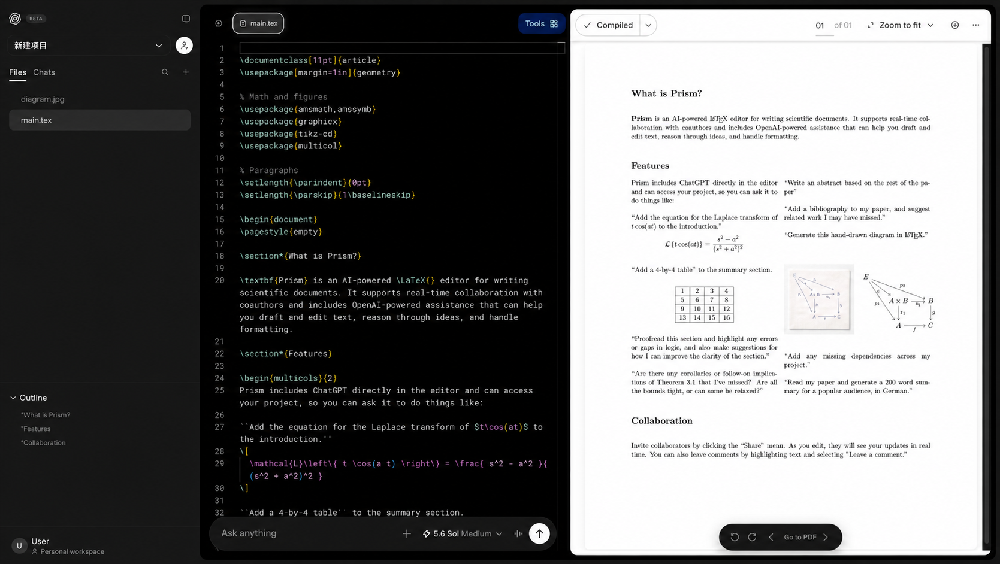

# Overleaf Server Pro Price and Open-Source Alternative

For years, many people who are using overleaf community edition have shown great interest in Overleaf Server Pro. Since Overleaf CE has too many limitations, for example:

* Without sandboxing, LaTeX compiles run with the same privileges as the container.
* No support for switching TeX Live versions. Each version requires a manual installation.
* No track changes, making collaborative writing and commenting quite difficult.
* No Git integration, making it difficult for local LaTeX users to join collaborative projects.

However, clear and reliable pricing information has been difficult to find. On Overleaf’s website, the only option is to contact sales. Server Pro does not appear available for direct purchase by individual users. With search engines, we found some pricing information.

Based on the information we have collected in the community, the **quota for Server Pro is**:

* You need to purchase licenses for _at least_ 10 people.
* A 10-person license costs about €3,477.61. (in 2024)
* For educations, 20 user 2640 Euro per year, 50 user 6050 Euro, 100 user 9963 Euro.
* Server Pro is only available in select regions (e.g., excluding mainland China).

Later in 2026, we used ChatGPT Search to identify more organizations that had purchased Overleaf Server Pro.

Overleaf Server Pro appears to cost around $300 per user per year. Smaller U.S. contracts indicate annual costs of roughly $320–$370 per user. Large institutional agreements can receive lower per-user pricing. For example, the Max Planck Society's three-year agreement averages about €51 per user each year. Contract terms, support, and deployment scope may differ. These records are not an official Overleaf price list.

<table><thead><tr><th width="197.69921875">Institution</th><th width="213.22265625">Period / Contract</th><th width="126.9140625" align="right">Users</th><th width="127.984375" align="right">Cost</th><th>Evidence</th></tr></thead><tbody><tr><td>🇺🇸 NASA</td><td><code>80NSSC25FA108</code>, 2024</td><td align="right">Up to 70</td><td align="right">$24,569.35</td><td><a href="https://govtribe.com/award/federal-contract-award/delivery-order-nng15sd22b-80nssc25fa108">Source</a></td></tr><tr><td>🇺🇸 NASA</td><td><code>80NSSC25FA471</code>, 2025–26</td><td align="right">—</td><td align="right">$36,183.91</td><td><a href="https://govtribe.com/award/federal-contract-award/delivery-order-nng15sd22b-80nssc25fa471">Source</a></td></tr><tr><td>🇺🇸 NIH</td><td>FY2024</td><td align="right">Up to 25</td><td align="right">$9,235.05</td><td><a href="https://nitaac.nih.gov/sites/default/files/2025-01/hhs-all-delivery-task-orders-january-2025.pdf">Source</a></td></tr><tr><td>🇺🇸 Naval Research Laboratory</td><td><code>N0017323P5005</code>, 2023–24</td><td align="right">37</td><td align="right">~$11,900</td><td><a href="https://www.federalcompass.com/fed-contract-award/N0017323P5005">Source</a></td></tr><tr><td>🇺🇸 NSWC Philadelphia</td><td><code>N6449821P5224</code>, 2021–24</td><td align="right">—</td><td align="right">~$24,800</td><td><a href="https://www.federalcompass.com/fed-contract-award/N6449821P5224">Source</a></td></tr><tr><td>🇺🇸 U.S. Treasury OFR</td><td><code>20341524P00017</code>, 2024–25</td><td align="right">—</td><td align="right">~$19,400</td><td><a href="https://www.cleat.ai/government/contracts/intent-to-sole-source-overleaf-server-pro-c97o">Source</a></td></tr><tr><td>🇩🇪 Max Planck Society / MPDL</td><td><code>42823</code>, 2026–29</td><td align="right">3,600</td><td align="right">€553,672</td><td><a href="https://files.auftrag-select.com/file/auftrag-select-public/pdfs/7179931/bekanntmachung.pdf">Source</a></td></tr><tr><td>🇩🇪 University of Rostock</td><td>Since 2023</td><td align="right">—</td><td align="right">—</td><td><a href="https://www.itmz.uni-rostock.de/en/anwendungen/dienste-fuer-forschung/lehre/kollaboration/overleaf/">Source</a></td></tr><tr><td>🇩🇪 Technical University of Munich</td><td>Current</td><td align="right">—</td><td align="right">—</td><td><a href="https://collab.dvb.bayern/spaces/TUMShareLaTeX/pages/67817359/ShareLaTeX%2BTUM">Source</a></td></tr><tr><td>🇩🇪 University of Konstanz</td><td>Current</td><td align="right">—</td><td align="right">—</td><td><a href="https://www.uni-konstanz.de/informatik/inf-system/Sharelatex-de.pdf">Source</a></td></tr><tr><td>🇩🇪 GWDG</td><td>Since at least 2021</td><td align="right">—</td><td align="right">—</td><td><a href="https://info.gwdg.de/news/service-sharelatex-overleaf-degraded-maintenance-on-tue-4pm-2/">Source</a></td></tr><tr><td>🇩🇪 Johannes Gutenberg University Mainz</td><td>Until May 2025</td><td align="right">—</td><td align="right">—</td><td><a href="https://www.en-zdv.uni-mainz.de/2025/04/08/change-at-overleaf-centrally-funded-licence-ends-in-may/">Source</a></td></tr><tr><td>🇧🇪 von Karman Institute</td><td>Since 2020</td><td align="right">290+</td><td align="right">—</td><td><a href="https://www.overleaf.com/blog/welcome-to-our-new-customer-von-karman-institute-for-fluid-dynamics-vki">Source</a></td></tr><tr><td>🇺🇸 Brookhaven National Laboratory</td><td>2021 trial</td><td align="right">—</td><td align="right">—</td><td><a href="https://indico.bnl.gov/event/11459/contributions/48931/attachments/35597/57768/SDCC%20Staff%20Meeting%202021-04-22.pdf">Source</a></td></tr></tbody></table>

Moreover, Server Pro offers significantly fewer features than their Overleaf SaaS platform. This is because Server Pro targets private-network deployments, including customers with strict security requirements (such as government departments).

However, community developers have worked for years to close Community Edition feature gaps. We recommend Ayakaleaf Pro, one of the most complete Overleaf forks available today. Below is a feature comparison.

<table data-search="false"><thead><tr><th>Feature</th><th align="center">Overleaf Community</th><th align="center">Overleaf Server Pro</th><th align="center">Ayakaleaf Pro (ours)</th></tr></thead><tbody><tr><td>Powerful LaTeX editor</td><td align="center">✓</td><td align="center">✓</td><td align="center">✓</td></tr><tr><td>Full project history</td><td align="center">✓</td><td align="center">✓</td><td align="center">✓</td></tr><tr><td>Commenting</td><td align="center">X</td><td align="center">✓</td><td align="center">✓</td></tr><tr><td>Real-time track changes</td><td align="center">X</td><td align="center">✓</td><td align="center">✓</td></tr><tr><td>Easy internal collaboration</td><td align="center">X</td><td align="center">✓</td><td align="center">✓</td></tr><tr><td>Private template management system</td><td align="center">X</td><td align="center">✓</td><td align="center">✓</td></tr><tr><td>Git integration</td><td align="center">X</td><td align="center">✓</td><td align="center">✓</td></tr><tr><td>Symbol Palette</td><td align="center">X</td><td align="center">✓</td><td align="center">✓</td></tr><tr><td>Admin Panel</td><td align="center">X</td><td align="center">✓</td><td align="center">✓</td></tr><tr><td>SSO integration</td><td align="center">X</td><td align="center">✓</td><td align="center">✓</td></tr><tr><td>GitHub integration</td><td align="center">X</td><td align="center">X</td><td align="center">✓</td></tr><tr><td>Zotero integration</td><td align="center">X</td><td align="center">X</td><td align="center">✓</td></tr><tr><td>Advanced Reference Search</td><td align="center">X</td><td align="center">X</td><td align="center">✓</td></tr><tr><td>Pandoc Import/Export</td><td align="center">X</td><td align="center">X</td><td align="center">✓</td></tr><tr><td>Python Script Runner</td><td align="center">X</td><td align="center">X</td><td align="center">✓</td></tr></tbody></table>

### Building an Online LaTeX Editor? Not Simple!

Since early 2026, you can see an Overleaf alternative almost every month, with the help of code agent like Claude or Codex. And OpenAI has also introduced their [Prism](https://prism.openai.com/), a product for scientific LaTeX writing.

<figure><figcaption></figcaption></figure>

While many have hyped the claim that Overleaf is dead and Prism will be the best free LaTeX editor, we find Prism remains far from a mature product.

The screenshot below captures a discussion from the OpenAI community about Prism. Most comments describe Prism as buggy and not yet ready for regular use.

<figure><figcaption></figcaption></figure>

**Building a reliable online LaTeX editor is far from simple.** Our observations suggest that Prism provisions a sandbox when a project is opened and keeps it running, likely because Codex remains available in the background. This allows Codex to respond quickly when a user starts an AI conversation. In our tests, each sandbox was provisioned with approximately 5 vCPUs, 6 GB of memory, and 64 GB of disk space.

This architecture can introduce substantial compute overhead when thousands of users are editing LaTeX projects simultaneously. Ayakaleaf takes a different approach: a sandbox is created only when a compilation is requested. Each compilation is limited to 1 vCPU and 1 GB of memory, and the sandbox is terminated once the compilation finishes. This significantly reduces persistent resource consumption and makes capacity planning more predictable for large-scale deployments.

More broadly, Prism illustrates how difficult it remains to combine AI capabilities with a reliable online development environment, even with access to powerful models and a mature ecosystem of open-source software. AI can improve the experience, but it is not a substitute for sound systems engineering. Ultimately, users depend on services that are reliable, predictable, and stable.

### Why Ayakaleaf Pro?

**Ayakaleaf Pro** is a fork of Overleaf Community Edition that brings Server Pro–level and SaaS-level features to self-hosted deployments — no per-user license required. It stays in sync with the upstream Overleaf codebase, so you get the same editor and workflow you're used to, plus:

* Sandboxed LaTeX compilation
* Multiple TeX Live versions
* Track changes and commenting
* Git and GitHub integration
* SSO and Admin Panel
* Private template management
* Zotero and advanced reference search
* Pandoc import/export
* Python Script Runner
* No per-user license fee

Our goal is to deliver a more complete self-hosted Overleaf experience — without a Server Pro license or a SaaS subscription. Ayakaleaf Pro preserves the familiar Overleaf workflow and upstream compatibility while adding features for collaboration, administration, integrations, and secure compilation.

### Why Do We Keep Reinventing the Wheel?

There is a broader question worth asking: _**when a mature open-source project already solves most of the hard problems, why is the instinct so often to rewrite it from scratch**_?&#x20;

Reimplementing an editor, a real-time collaboration layer, a compiler pipeline, and years of accumulated edge-case fixes is enormously expensive — and much of that effort goes toward rediscovering problems the original project solved long ago. More often than not, extending a solid foundation and contributing the missing pieces back is the more practical engineering choice.

What I really want to address is this:

> _In the age of AI, people love to show off._

"I built my own Overleaf" sounds far more impressive than "I added some features to Overleaf" — so that's the story people prefer to tell. That's also why a new "AI LaTeX editor" seems to pop up every month.

But in reality, these AI-assisted rewrites are nowhere near the reliability and maturity that come from a decade of real-world battle-testing like overleaf. Give it two months and they'll abandon their editor like a Christmas toy in February. Trust me.

