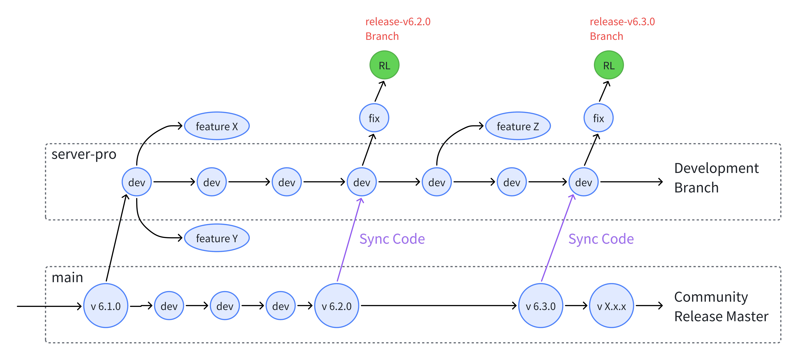

# Development Guidelines

### Introductions

Before you delve into development, We hope you can understand the folloing things:

* Overleaf is developed in an [internal repository](http://github.com/overleaf/internal) officially, and the community edition is published in [overleaf/overleaf](https://github.com/overleaf/overleaf). A copybot is responsible for synchronizing code between the internal and public repositories.
* [Ayaka-notes/overleaf-pro](https://github.com/ayaka-notes/overleaf-pro) is a forked version of overleaf community, We hope this project can be long-term, so please follow the rules before make contributions.

### Commit Rules

* Please do not make extensive modifications to the existing Overleaf code. Concentrate as much functionality as possible in the `services/web/modules` folder. This will minimize our workload when merging and updating the code later.
* Vibe coding is indeed very an easy way, but it can easily make a mess of our project, making it unmaintainable later on, so please use it with caution. **We don't accept any pull requests based solely on AI programming/Vibe Coding.(For Example** [**#1430**](https://github.com/overleaf/overleaf/issues/1430)**)**
* We don't accept any translation fixes for Overleaf, you can report it to upstream or contact overleaf support. Also, Please do not update any translation-related content during development; use existing translations whenever possible.
* Avoid introducing environment variables unless absolutely necessary. If required, ensure they are as consistent as possible with those in the Overleaf toolkit or [docs.overleaf.com](https://docs.overleaf.com/).

### Branch Rules

We use the following branch for overleaf-pro development:

* `main`: This branch is used only for upstream code synchronize,  please **DO NOT** commit any external changes. In this branch, we will set some tags like `ce-v[X.x.x]`, which indecates this corresponds to `v[X.x.x]` in the Overleaf Official Community Edition. Notes: this tag is immutable!
* `server-pro`: This branch is the default branch for daily development.
* `feature-X`: This branch is used for development a specific feature.
* `release-vX.0.0`: The branch specific for release, we will do some hot-fix becore release.

<figure><figcaption><p>Branch Rules for Overleaf Pro</p></figcaption></figure>

### GitHub Action

[GitHub Action](https://github.com/ayaka-notes/overleaf-pro/actions) is responsible for auto CI/CD, which includes:

* Nightly update main branch
* Build docker image for development
* Release docker image

### Q\&A

<details>

<summary>How to find the commit hash for Overleaf Community Edition <code>X.0.0</code> ?</summary>

First of all, you need to pull the docker image and run with the following command to inspect labels in this docker image:


```shellscript
docker inspect --format='{{json .Config.Labels}}' sharelatex/sharelatex:6.0.0
{"com.overleaf.ce.revision":"b0d05c0cf0750714e1f467d20ed6c5f5e9467e8f","org.opencontainers.image.ref.name":"ubuntu","org.opencontainers.image.version":"24.04"}
```


Then you can check if the [commit(b0d05c0)](https://github.com/overleaf/overleaf/commit/b0d05c0cf0750714e1f467d20ed6c5f5e9467e8f) is present in upstream master branch.

</details>

<details>

<summary>Why the commit hash is the same in CE image between <code>6.0.0</code> and <code>6.0.1</code>?</summary>

This is an expected behavior. The 6.0.1 release is a minor patch release built on top of the 6.0.0 image. The changes are applied by patching the existing 6.0.0 image, instead of rebuilding the image from a new commit. Therefore, the commit hash inside the image is identical between 6.0.0 and 6.0.1.

For detailed infomation, see [hotfix](https://github.com/overleaf/overleaf/tree/main/server-ce/hotfix).

</details>

