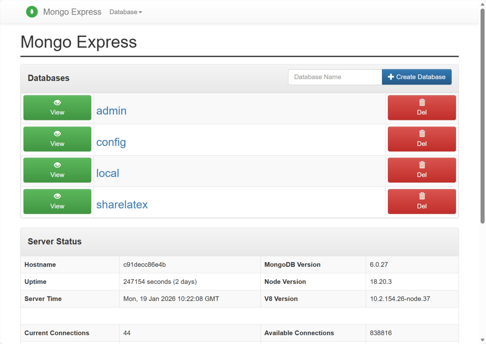

# Schemas In MongoDB

In this section, we will discuss Overleaf's data model. Overleaf uses MongoDB for data persistence, the only database name is called `sharelatex`, which is also the predecessor of Overleaf.

If you haven't setup Mongo Express for overleaf, it's highly recommended to see [setup-develop-tools.md](../environment/setup-develop-tools.md "mention"), and setup your mongo.

Once you have setup your Mongo Express, you can login [http://localhost:8081/](http://localhost:8081/) with `admin:pass` credentials.

<figure><figcaption></figcaption></figure>

There are a ranges of schemas in mongoDB, here we mainly focus on Overleaf CE related:


[users-collection.md](users-collection.md)



[projects-collection.md](projects-collection.md)



[docs-collection.md](docs-collection.md)


