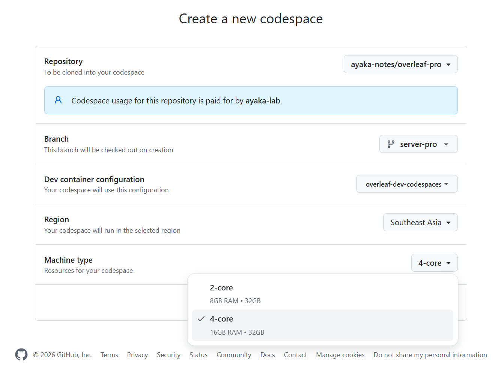

# Setup Develop Environment (Codespace)

To save time and quickly build the development environment, we provide another version of the development environment configuration, that's GitHub Codespace.

## Configuration Tutorial



### Create Codespaces

Click the following button to create a cloud codespaces for server-pro development.

[](https://codespaces.new/ayaka-notes/overleaf-pro)

It's more recommented to choose **Machine Type** at least **4-core**. For larger machine type, you can make a request to GitHub's official support team by filing a ticket [here](https://support.github.com/contact?tags=rr-codespaces%2Ccat_codespaces).

<figure><figcaption></figcaption></figure>



### Launch Setup Script

You will need to wait patiently before the codespace get created. After you can have access to your Terminal, run the folloing command:

```
cd develop/
bin/setup
```

<figure><figcaption></figcaption></figure>


This script (`bin/setup`) allows you to set up the development environment on the latest commit of the `server-pro` branch in the shortest possible time. It may not be applicable to older versions/other branches.

We build development docker image every day with [GitHub Action](https://github.com/ayaka-notes/overleaf-pro/actions).




### Access Your Launchpad

Switch to port tab, you will see a list of avaiable web port. Click the one with `80`. You should see launchpad page now.

<figure><figcaption></figcaption></figure>

You will see:

<figure><figcaption></figcaption></figure>



### Enjoy Development

Now, time to your own time! Start build your awesome feature. You need to run the following command to enable realtime display:


```bash
docker compose -f docker-compose.yml -f docker-compose.dev.yml -f ./docker-compose.image.yml up --no-deps --detach
```



