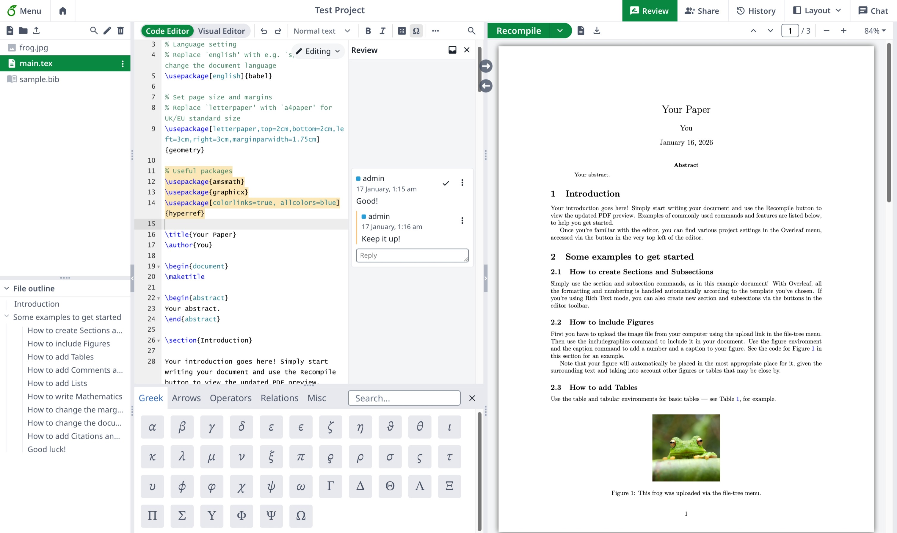

# Home

<h3 align="center"><mark style="color:purple;">\begin</mark> <mark style="color:$info;"><strong>{</strong></mark> <mark style="color:$primary;">Documents</mark> <mark style="color:$info;"><strong>}</strong></mark></h3>

<h2 align="center">Overleaf Pro Edition</h2>


<p align="center">Write like a rocket scientist with Overleaf Pro<br>— <em><mark style="color:green;"><strong>unlock all Features</strong></mark></em>, an <em>on-Premise</em> solution that <em>anyone</em> can use.</p>

<p align="center"><a href="https://app.gitbook.com/s/yLFrF2L1FakWXkhqpOnS/installation/using-the-github-codespace" class="button primary" data-icon="rocket-launch">Get Started</a>   <a href="https://app.gitbook.com/s/yLFrF2L1FakWXkhqpOnS/" class="button secondary" data-icon="book">Read Documents</a></p>

<p align="center"></p>

<figure><figcaption></figcaption></figure>


### Features

<table data-view="cards"><thead><tr><th></th><th></th><th></th><th data-hidden data-card-target data-type="content-ref"></th><th data-hidden data-card-cover data-type="image">Cover image</th></tr></thead><tbody><tr><td><h4><i class="fa-clone">:clone:</i></h4></td><td><a href="https://app.gitbook.com/s/yLFrF2L1FakWXkhqpOnS/readme/features-and-copyright#features-01-templates-system"><mark style="color:$primary;"><strong>Template System</strong></mark></a></td><td><mark style="color:$info;">Publish your</mark>  <span class="math">\LaTeX</span> <mark style="color:$info;">template to your members.</mark></td><td></td><td data-object-fit="fill"><a href=".gitbook/assets/template.jpeg">template.jpeg</a></td></tr><tr><td><h4><i class="fa-server">:server:</i> </h4></td><td><a href="https://app.gitbook.com/s/yLFrF2L1FakWXkhqpOnS/readme/features-and-copyright#features-02-sandbox-compile"><mark style="color:$primary;"><strong>Sandbox Compile</strong></mark></a></td><td><mark style="color:$info;">Compile your project in Docker with isolation and any TeXLive version.</mark></td><td></td><td data-object-fit="contain"><a href=".gitbook/assets/texlive-switch.png">texlive-switch.png</a></td></tr><tr><td><h4><i class="fa-git-alt">:git-alt:</i></h4></td><td><a href="https://app.gitbook.com/s/yLFrF2L1FakWXkhqpOnS/readme/features-and-copyright#features-03-git-intergration"><mark style="color:$primary;"><strong>Git Intergration</strong></mark></a></td><td><mark style="color:$info;">Synchronized your project with GitHub or GitLab.</mark></td><td></td><td data-object-fit="fill"><a href=".gitbook/assets/git-bridge.png">git-bridge.png</a></td></tr><tr><td><h4><i class="fa-pi">:pi:</i></h4></td><td><a href="https://app.gitbook.com/s/yLFrF2L1FakWXkhqpOnS/readme/features-and-copyright#features-04-symbol-palette"><mark style="color:$primary;"><strong>Symbol</strong></mark> <mark style="color:$primary;"><strong>Palette</strong></mark></a></td><td><mark style="color:$info;">Input your LaTeX symbol easily and more quickly.</mark></td><td></td><td><a href=".gitbook/assets/symbol-palette.jpeg">symbol-palette.jpeg</a></td></tr><tr><td><h4><i class="fa-user">:user:</i> </h4></td><td><a href="https://app.gitbook.com/s/yLFrF2L1FakWXkhqpOnS/readme/features-and-copyright#features-05-admin-panel"><mark style="color:$primary;"><strong>User Management</strong></mark></a></td><td><mark style="color:$info;">Manage your team and users with admin panel.</mark></td><td></td><td><a href=".gitbook/assets/User-Management.png">User-Management.png</a></td></tr><tr><td><h4><i class="fa-message-pen">:message-pen:</i> </h4></td><td><a href="https://app.gitbook.com/s/yLFrF2L1FakWXkhqpOnS/readme/features-and-copyright#features-06-review-panel"><mark style="color:$primary;"><strong>Review Panel</strong></mark></a></td><td><mark style="color:$info;">Discuss with your instructor and comments on your thesis.</mark></td><td></td><td data-object-fit="fill"><a href=".gitbook/assets/review.jpeg">review.jpeg</a></td></tr><tr><td><h4><i class="fa-user-key">:user-key:</i></h4></td><td><a href="https://app.gitbook.com/s/yLFrF2L1FakWXkhqpOnS/readme/features-and-copyright#features-08-sso"><mark style="color:$primary;"><strong>SSO Support</strong></mark></a></td><td><mark style="color:$info;">Connect with OAuth SAML or LDAP provider.</mark></td><td></td><td data-object-fit="fill"><a href=".gitbook/assets/image (2).png">image (2).png</a></td></tr><tr><td><h4><i class="fa-table-cells-rows">:table-cells-rows:</i></h4></td><td><a href="https://app.gitbook.com/s/yLFrF2L1FakWXkhqpOnS/readme/features-and-copyright#features-10-self-registeration"><mark style="color:$primary;"><strong>Self Register</strong></mark></a></td><td><mark style="color:$info;">Regiser quickly with email and password.</mark></td><td></td><td data-object-fit="contain"><a href=".gitbook/assets/image (1).png">image (1).png</a></td></tr><tr><td><h4><i class="fa-server">:server:</i></h4></td><td><a href="https://app.gitbook.com/s/yLFrF2L1FakWXkhqpOnS/readme/features-and-copyright#features-09-arm-supported"><mark style="color:$primary;"><strong>ARM Supported</strong></mark></a></td><td><mark style="color:$info;">Run your overleaf with Mac mini or arm server.</mark></td><td></td><td data-object-fit="contain"><a href=".gitbook/assets/image.png">image.png</a></td></tr></tbody></table>



{% column width="50%" %}
### <i class="fa-github">:github:</i>  Get On Premises in 5 minutes

Setting up your own Ovlereaf Pro and your online $$\LaTeX$$ environment with **GitHub Codespace** immediately!

You don't need any skill with Linux or server management, just <mark style="color:$primary;">**One Click Deployment**</mark> on GitHub!

***

<a href="https://github.com/ayaka-notes/overleaf" class="button primary" data-icon="server">Start on GitHub</a> <a href="https://app.gitbook.com/s/yLFrF2L1FakWXkhqpOnS/getting-started" class="button secondary" data-icon="terminal">Deploy Manuel</a>


{% column width="50%" %}

```bash
#/bin/bash
# 1. Install your Docker Env
sudo apt-get install docker

# 2. Clone Overleaf Toolkit
cd toolkit && bin/init

# 3. Config your Overleaf

# 4. Finish your installation
# ...
```






{% column width="41.66666666666667%" %}
{% embed url="https://files.gitbook.com/v0/b/gitbook-x-prod.appspot.com/o/spaces%2FvnT8IAADTAThJZZpvM7Q%2Fuploads%2FMVJjuRaBQnhqbqkw8YpL%2Fvisual-editor.mp4?alt=media&token=13e11fa4-e682-460f-9555-ad9b419fe953" %}


{% column width="58.33333333333333%" %}
### <i class="fa-globe">:globe:</i>  Enjoy Online $$\LaTeX$$ Editor

No downloads, no setup, and no need to know $$\LaTeX$$ before you start.

* Visual Editor and Code Editor
* Thousands of free templates
* Detailed guidance and LaTeX learning
* Stellar support from real-life TeXperts

<p align="right"><a href="https://www.overleaf.com/" class="button primary" data-icon="leaf">Go Overleaf Official</a><a href="https://www.overleaf.com/learn" class="button secondary" data-icon="book-open">Learn LaTeX</a></p>





{% column width="50%" valign="middle" %}
### <i class="fa-people-group">:people-group:</i> Write your best work, together

Say goodbye to endless rounds of email feedback.

* Access from anywhere, on any device
* Document sharing
* Simultaneous editing and commenting
* Real-time track changes
* Project history and version control


{% column width="50%" %}
<figure><figcaption></figcaption></figure>







{% column width="50%" %}
<div align="left" data-with-frame="true"><figure><figcaption></figcaption></figure></div>


{% column width="50%" %}
### <i class="fa-file-code">:file-code:</i> Read more about overleaf developer document.

There aren't many Overleaf `developer` resources available online.

Here you can find the most of Overleaf's architecture and developer tools, also some debug skills.

<p align="right"><a href="https://app.gitbook.com/o/aXieu2C3Ngt9u0fFRG9K/s/I2qEfJyb19sFvDmuZcCm/" class="button secondary" data-icon="book">Developer Documentation</a> </p>





{% column width="50%" %}
### <i class="fa-docker">:docker:</i> $$\TeX$$ Live in Docker build by @Ayaka-Notes

Overleaf uses <mark style="color:blue;">**Docker**</mark> containers to compile your $$\LaTeX$$ projects. Your project is compiled in an isolated Docker sandbox, ensuring absolute <mark style="color:green;">**security**</mark>.

Therefore, we provide a $$\TeX$$ Live image (from 2019 to latest) that allows for free switching between versions, including all fonts and $$\LaTeX$$ packages.

<a href="https://app.gitbook.com/o/aXieu2C3Ngt9u0fFRG9K/s/0bsEVRuqHiTwccEZfTnf/" class="button secondary" data-icon="docker">TeXLive Full Image</a>&#x20;


{% column width="50%" %}
<pre class="language-latex" data-title="main.tex" data-line-numbers><code class="lang-latex"><strong>\documentclass{article}
</strong>
\title{An Awesome Document}
\author{your name}
\date{\today}

<strong>\begin{document}
</strong>\maketitle
Start Your contents here...
\section{Introduction}
Start Your introduction here...

<strong>\end{document}
</strong></code></pre>




