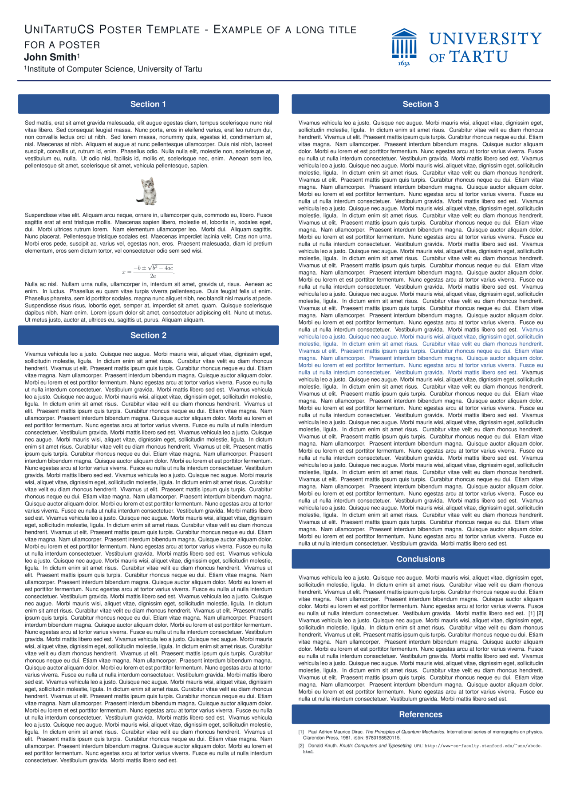

# Templates


This feature is initially developed by [yu-i-i/overleaf-cep](https://github.com/yu-i-i/overleaf-cep), and modified and optimized by [ayaka-notes/overleaf-pro](https://github.com/ayaka-notes/overleaf-pro).




<figure><figcaption></figcaption></figure>



<figure><figcaption></figcaption></figure>



### Configuration

The Template Gallery feature is controlled using the following environment variables:

* `OVERLEAF_TEMPLATE_GALLERY`: Set to `true` to enable the Template Gallery.
*   `OVERLEAF_TEMPLATE_CATEGORIES`: An optional whitespace-separated list of zero or more template category keys. Valid keys include:

    * _`academic-journal`_
    * _`book`_
    * _`presentation`_
    * _`poster`_
    * _`cv`_
    * _`homework`_
    * _`bibliography`_
    * _`calendar`_
    * _`formal-letter`_
    * _`report`_
    * _`thesis`_
    * _`newsletter`_

    The special key _`all`_ is automatically appended. This key represents a category that includes all templates.

    For each category key, the following optional environment variables can be set:

    * `TEMPLATE_<KEY>_NAME`: The display name of the template category.
    * `TEMPLATE_<KEY>_DESCRIPTION`: A short description of the category.

    If a category key contains a hyphen (`-`), replace it with an underscore (`_`) in the environment variable names.
* `ENABLE_CONVERSIONS`: Must be set to `true` to enable thumbnail and preview generation for templates.
* `OVERLEAF_NON_ADMIN_CAN_PUBLISH_TEMPLATES`: Determines whether non-admin users can publish templates. Defaults to `false`.

### Permissions for Publish

By default, admin in system will have access to publish templates. In the mean time, you can also set a non-admin user who is specifically responsible for publishing the curated list of templates that are visible on your local template gallery `/templates`.

To do this, you'll need to set the environment variable `OVERLEAF_TEMPLATES_USER_ID` in `toolkit/config/variables.env` to the `ID` of the user who will be responsible for template management within your instance, for example:

```dotenv
OVERLEAF_TEMPLATES_USER_ID=56a8865231faeb5f07d69959
```

### Publishing Templates

For each template you want to upload:

1. Create a project containing the template's source code and make sure it compiles.
2. In the editor's left-hand menu, choose **Publish as Template**.
3. In the form that appears, enter the template details:
   * The _Title_ must be unique.
   * The _Description_ field supports Markdown formatting.
   * The _Author_ field accepts Markdown-formatted links.

After submission, template details can be edited, or the template can be deleted via the Template Gallery page. Users can manage their own templates; admins can manage any template.

Here is an example:


```dotenv
#################
#   TEMPLATES   #
#################

ENABLE_CONVERSIONS=true

OVERLEAF_TEMPLATE_GALLERY=true
OVERLEAF_NON_ADMIN_CAN_PUBLISH_TEMPLATES=true
OVERLEAF_TEMPLATE_CATEGORIES=academic-journal book presentation poster cv homework bibliography calendar formal-letter report thesis newsletter

TEMPLATE_ACADEMIC_JOURNAL_NAME=Journal articles
TEMPLATE_ACADEMIC_JOURNAL_DESCRIPTION=Templates for academic journal submissions, including formats for major publishers and preprint servers.

TEMPLATE_BIBLIOGRAPHY_NAME=Bibliographies
TEMPLATE_BIBLIOGRAPHY_DESCRIPTION=Styles for creating and managing bibliographies with BibTeX or BibLaTeX. Suitable for use in academic papers, theses, and reports.

TEMPLATE_BOOK_NAME=Books
TEMPLATE_BOOK_DESCRIPTION=Templates for writing books or long-form documents, including chapter structuring, front matter, and indexing.

TEMPLATE_CALENDAR_NAME=Calendars
TEMPLATE_CALENDAR_DESCRIPTION=Templates to create yearly, monthly, or weekly calendars. Useful for personal planners or event scheduling.

TEMPLATE_CV_NAME=CVs and résumés
TEMPLATE_CV_DESCRIPTION=Templates for CVs and résumés with various formats for academic, industry, and creative positions.

TEMPLATE_FORMAL_LETTER_NAME=Formal letters
TEMPLATE_FORMAL_LETTER_DESCRIPTION=Templates for professional letters, such as cover letters, recommendation letters, and official correspondence.

TEMPLATE_HOMEWORK_NAME=Assignments
TEMPLATE_HOMEWORK_DESCRIPTION=Templates for homework, coursework, and problem sets. Designed to be clean and well-structured for students and educators.

TEMPLATE_NEWSLETTER_NAME=Newsletters
TEMPLATE_NEWSLETTER_DESCRIPTION=Templates for creating newsletters with formats for academic, corporate, or community communications.

TEMPLATE_POSTER_NAME=Posters
TEMPLATE_POSTER_DESCRIPTION=Templates for scientific and academic posters, typically used in conferences and research presentations.

TEMPLATE_PRESENTATION_NAME=Presentations
TEMPLATE_PRESENTATION_DESCRIPTION=Templates for Beamer and other presentation formats, tailored for academic talks and lectures.

TEMPLATE_REPORT_NAME=Reports
TEMPLATE_REPORT_DESCRIPTION=Templates for technical, lab, or project reports. Includes sections for figures, tables, and references.

TEMPLATE_THESIS_NAME=Theses
TEMPLATE_THESIS_DESCRIPTION=Templates for writing theses and dissertations, following institutional formatting and citation guidelines.

TEMPLATE_ALL_NAME=All templates
TEMPLATE_ALL_DESCRIPTION=Browse a collection of all available LaTeX templates, categorized by document type, style, and purpose.

```


### Transferring templates from overleaf.com <a href="#transferring-templates-from-overleaf.com" id="transferring-templates-from-overleaf.com"></a>

As Overleaf Pro has been architected to work offline, there isn't an automated way to integrate [overleaf.com](https://www.overleaf.com/) gallery templates into your on-premise installation, it is however possible to do this manually on a per template basis.

By default, Overleaf Pro is configured to use a basic scheme version of TeXLive for compiles. This basic version is lightweight and only contains a very limited subset of LaTeX packages which, will most likely result in missing package errors for your users when attempting to use templates from [overleaf.com](https://www.overleaf.com/) on your local on-premise instance.

Unfortunately, whilst there isn't an automatic way to install missing packages, we do have a configurable setting within Server Pro that will allow your users to compile projects with access to more packages, and in a more secure way. This feature is called [Sandbox Compiles](https://docs.overleaf.com/on-premises/configuration/overleaf-toolkit/server-pro-only-configuration/sandboxed-compiles) (also known as Sibling Containers).

To ensure that downloaded templates are compatible with your on-premise Server Pro instance, we highly recommend that you enable [Sandbox Compiles](https://docs.overleaf.com/on-premises/configuration/overleaf-toolkit/server-pro-only-configuration/sandboxed-compiles) as this feature will provide your users with access to the same TeX Live environment as that on [overleaf.com](https://www.overleaf.com/). These images contain the most popular packages and fonts and have already been tested against our gallery templates.

You can find additional information about configuring what TeX Live versions users are able to choose from within their project along with setting the default TeX Live image version for new projects in the [Changing the TeX Live Image](https://docs.overleaf.com/on-premises/configuration/overleaf-toolkit/server-pro-only-configuration/sandboxed-compiles#changing-the-tex-live-image) section of our documentation.

1. Navigate to the [Template Gallery](https://www.overleaf.com/latex/templates) on [overleaf.com](https://www.overleaf.com/) and locate the required template, for example [IEEE Photonics Journal Paper Template - Example Submission](https://www.overleaf.com/latex/examples/ieee-photonics-journal-paper-template-example-submission/bsfjjfkdsjds)
2. Click on the **Open as Template** button
3. Click on the project menu and choose **Download Source**
4. Next, log into the on-premise Server Pro account
5. Click the **New Project** button from the projects dashboard and choose **Upload Project**
6. Click the **Select a .zip file** button and choose the downloaded template zip file

The user can then use this newly uploaded template within their own account, or, as the templates user, you can publish it for other users to use.

### Q\&A

<details>

<summary>Can I delete the project after publishing the corresponding template?</summary>

**Answer:** Yes, but we do not recommend doing so. When you publish a template, we take a snapshot of the project and save the project as a zip file at the time of publication. This ensures that even if you delete the project corresponding to the template, the template will not be affected.

However, we will also record the ProjectID associated with this template, which makes it easy for you to update the template in the future.

If you delete the corresponding project, you will not see the "Admin: Source Project" button on the template details page (see image below).

<figure><figcaption></figcaption></figure>


</details>

<details>

<summary>For some projects, why is it that releasing a template takes such a long time?</summary>

**Answer:** When you publish the template, we save the project as a zip and a pdf file, which is usually quick. However, we also need to generate thumbnails for the PDF so they can be displayed in the template details.

Thumbnail generation time typically depends on the content of your PDF's first page. To balance bewteen display quality and convert time, we choose a middle one as width.

However, if the first page of the PDF contains a lot of text, converting the thumbnails may take 40 seconds or even more, please be patient. Here is an example of large poster, it will take longer time.

<figure><figcaption><p>A large poster</p></figcaption></figure>

</details>
