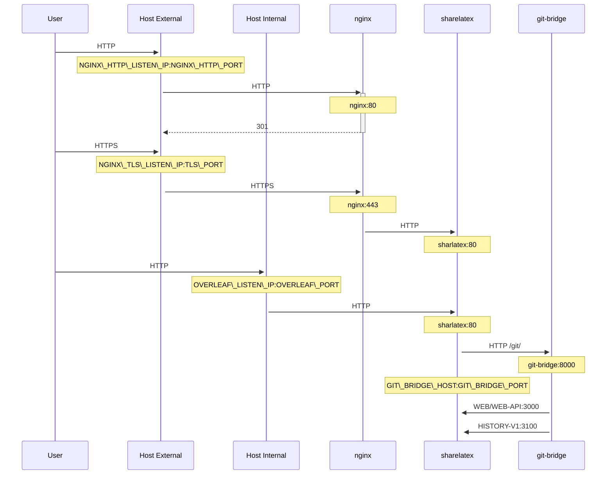

# TLS proxy

An optional TLS proxy for terminating HTTPS connections, using NGINX.

Run `bin/init --tls` to initialise local configuration with NGINX proxy configuration, or to add NGINX proxy configuration to an existing local configuration. A **sample** private key is created in `config/nginx/certs/overleaf_key.pem` and a **dummy** certificate in `config/nginx/certs/overleaf_certificate.pem`. Either replace these with your actual private key and certificate, or set the values of the `TLS_PRIVATE_KEY_PATH` and `TLS_CERTIFICATE_PATH` variables to the paths of your actual private key and certificate respectively.

A default config for NGINX is provided in `config/nginx/nginx.conf` which may be customised to your requirements. The path to the config file can be changed with the `NGINX_CONFIG_PATH` variable.


If you have a **docker-compose.yml** based deployment, or manage your own NGINX reverse proxy, you can view an example **nginx.conf** file [here](https://github.com/overleaf/toolkit/blob/master/lib/config-seed/nginx.conf).


Add the following section to your `config/overleaf.rc` file if it is not there already:

```
# TLS proxy configuration (optional)
NGINX_ENABLED=false
NGINX_CONFIG_PATH=config/nginx/nginx.conf
NGINX_HTTP_PORT=80

# Replace these IP addresses with the external IP address of your host
NGINX_HTTP_LISTEN_IP=127.0.1.1 
NGINX_TLS_LISTEN_IP=127.0.1.1
TLS_PRIVATE_KEY_PATH=config/nginx/certs/overleaf_key.pem
TLS_CERTIFICATE_PATH=config/nginx/certs/overleaf_certificate.pem
TLS_PORT=443
```


If you are using an external TLS proxy (i.e. not managed by the Overleaf Toolkit), please ensure that `OVERLEAF_TRUSTED_PROXY_IPS=loopback,<ip-of-your-tls-proxy>` is set in your `config/variables.env`, e.g. `OVERLEAF_TRUSTED_PROXY_IPS=loopback,192.168.13.37`.



If you are using a subnet from `172.16.0.0/12` (default subnet for Docker networks) for your local network, you will need to set `OVERLEAF_TRUSTED_PROXY_IPS=loopback,<network>` in your `config/variables.env`. Where `<network>` is the `IPAM -> Config -> Subnet` value in `docker inspect overleaf_default`, e.g. `OVERLEAF_TRUSTED_PROXY_IPS=loopback,172.19.0.0/16`. This is to prevent the spoofing of `X-Forwarded` headers.



If the `OVERLEAF_TRUSTED_PROXY_IPS` is not set manually it defaults to `loopback`. If setting manually, you must ensure you include one of `loopback`, `localhost` or `127.0.0.1`, which trusts the **nginx** instance running inside the **sharelatex** container.


In order to run the proxy, change the value of the `NGINX_ENABLED` variable in `config/overleaf.rc` from `false` to `true` and re-run `bin/up`.

By default, the HTTPS web interface will be available on `https://127.0.1.1:443`. Connections to `http://127.0.1.1:80` will be redirected to `https://127.0.1.1:443`. To change the IP address that NGINX listens on, set the `NGINX_HTTP_LISTEN_IP` and `NGINX_TLS_LISTEN_IP` variables. The ports can be changed via the `NGINX_HTTP_PORT` and `TLS_PORT` variables.

If NGINX fails to start with the error message `Error starting userland proxy: listen tcp4 ... bind: address already in use` ensure that `OVERLEAF_LISTEN_IP:OVERLEAF_PORT` does not overlap with `NGINX_HTTP_LISTEN_IP:NGINX_HTTP_PORT`.


