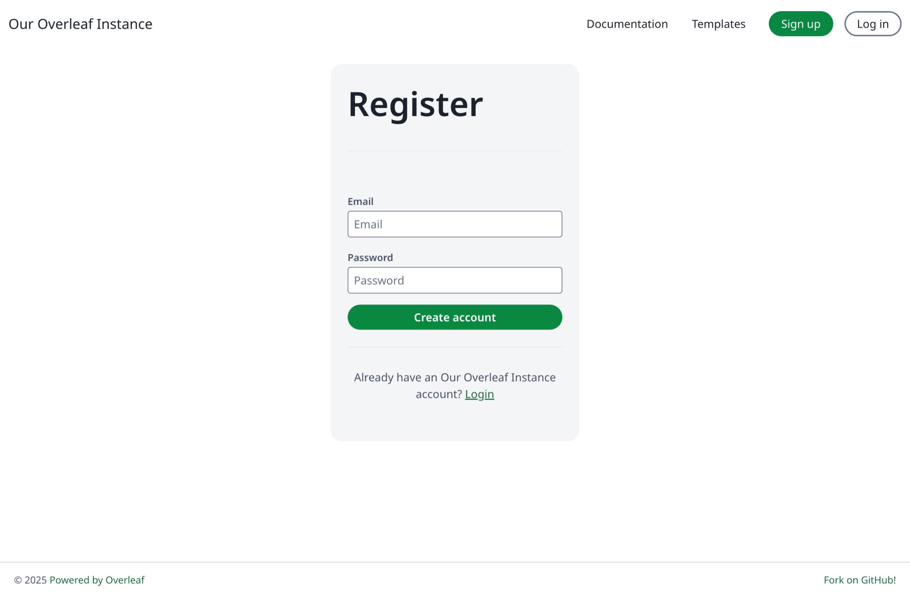

# Features and Copyright

We respect copyright, so we list here all the features and the code used in this project. In this page, we provide information on new features of Overleaf Pro and related code copyrights.

Unless otherwise specified, we use OpenAI’s Codex for code review and PR review. During this process, we fixed many security issues, and we express our sincere gratitude to them. For details, see [ayaka-notes/overleaf-pro/pull](https://github.com/ayaka-notes/overleaf-pro/pulls).

### Overview

Over the years, we have many community developers who have made significant efforts to improve the Overleaf Community Edition, they are:

* [https://github.com/ertuil/overleaf](https://github.com/ertuil/overleaf)
* [https://github.com/AllanChain/lcpu-overleaf](https://github.com/AllanChain/lcpu-overleaf)
* [https://github.com/yu-i-i/overleaf-cep/](https://github.com/yu-i-i/overleaf-cep/)
* [https://github.com/ayaka-notes/overleaf](https://github.com/ayaka-notes/overleaf)
* [https://github.com/davrot/overleaf\_with\_admin\_extension](https://github.com/davrot/overleaf_with_admin_extension)
* [https://github.com/overleaf/overleaf/pull/1447](https://github.com/overleaf/overleaf/pull/1447) (GitHub integration)
* [https://github.com/overleaf/overleaf/pull/1385](https://github.com/overleaf/overleaf/pull/1385) (Typst support)

We may have used related code in our project, and we would like to express our gratitude to them.

#### Features 01: Templates System

This feature is mainly developed by [yu-i-i/overleaf-cep](https://github.com/yu-i-i/overleaf-cep). we modified some code for enhancement. So that you can:

* Download Templates directly on the template pages.
* Open project corresponding to the Template.
* Convert to higher quality cover images (and in a shorter time).



<figure><figcaption></figcaption></figure>



<figure><figcaption></figcaption></figure>



#### Features 02: Sandbox Compile

This feature is impled by [overleaf official](https://github.com/overleaf/overleaf/tree/main/services/clsi), we add some code to enable this feature. Also, we provide you with [texlive-full](https://github.com/ayaka-notes/texlive-full) image built specially for overleaf pro.

<figure><figcaption>
Sandbox Compile
</figcaption></figure>

#### Features 03: ​Git Intergration​

This feature is developed by [ayaka-notes/overleaf-pro](https://github.com/ayaka-notes/overleaf-pro). Overleaf provides an official component called git-bridge, it's available at [here](https://github.com/overleaf/overleaf/tree/main/services/git-bridge).

We just implied a connector between git-bridge and overleaf, which is the same as what overleaf does in their SaaS platform.



<figure><figcaption></figcaption></figure>



<figure><figcaption></figcaption></figure>



#### Features 04: Symbol Palette

This feature is impled by [overleaf official](https://github.com/overleaf/overleaf/tree/main/services/clsi), we just add the missing code, align with upstream update.

<figure><figcaption>
Symbol Palette
</figcaption></figure>

#### Features 05: Admin Panel


When your system has 1000 users or projects, the admin panel will only display the latest 1000 users or projects. Please use the search panel to search for specific users or projects.


This feature is mainly developed by [yu-i-i/overleaf-cep](https://github.com/yu-i-i/overleaf-cep). we modified some code for enhancement. So that you can:

* Search users with backend when you have more then 1000+ users.
* Search projects with backend when you have more then 1000+ projects.
* Open projects directly on project admin panel.
* View and adjust user's compile time limit on admin panel.
* Reset user's password directly on admin panel.
* Other enhancement...



<figure><figcaption></figcaption></figure>

<figure><figcaption></figcaption></figure>



<figure><figcaption></figcaption></figure>

<figure><figcaption></figcaption></figure>



#### Features 06: Review Panel

This feature is mainly developed by [overleaf official](https://github.com/overleaf/overleaf/tree/main/services/clsi), we just add the missing code from [yu-i-i/overleaf-cep](https://github.com/yu-i-i/overleaf-cep) and [ertuil/overleaf](https://github.com/ertuil/overleaf), which is a connector between chat and web service.

<figure><figcaption>
Review panel
</figcaption></figure>

#### Features 07: External URL

This feature is mainly developed by [yu-i-i/overleaf-cep](https://github.com/yu-i-i/overleaf-cep). CEP implied an external service called linked-url-proxy, which can be safely used to fetch external files with domain/ip limit.

<figure><figcaption>
External URL
</figcaption></figure>

#### Features 08: SSO

This feature is mainly developed by [yu-i-i/overleaf-cep](https://github.com/yu-i-i/overleaf-cep). CEP implied a sub modules to connect passport with overleaf web authentication.

<figure><figcaption>
Login Page
</figcaption></figure>

#### Features 09: ARM supported

we use GitHub Action to build and publish docker images with x86 and arm archtecture. When you download the image, it will automatically select the appropriate architecture based on your system.

<figure><figcaption>
Github Package
</figcaption></figure>

#### Features 10: Self Registeration

This feature is developed by [ayaka-notes/overleaf-pro](https://github.com/ayaka-notes/overleaf-pro). You can:

* limit user register with specific domain
* open user register to any one who have access to your overleaf

<figure><figcaption>
Register page
</figcaption></figure>

#### Features 11: Learn Wiki

This feature is developed by [ayaka-notes/overleaf-pro](https://github.com/ayaka-notes/overleaf-pro). You can see latest learn wiki from overleaf, but we don't own any copyright of those documents! We just download it from overleaf server the first time you enable this feature, and update periodically.

<figure><figcaption>
Wiki page
</figcaption></figure>

#### Features 12: GitHub Sync

This feature is developed by [ayaka-notes/overleaf-pro](https://github.com/ayaka-notes/overleaf-pro), also modified and fixed by [yu-i-i/overleaf-cep](https://github.com/yu-i-i/overleaf-cep).

<figure><figcaption></figcaption></figure>

#### Features 13: Python Runner

This feature is developed by overleaf official. You can run python script in your browser.

<figure><figcaption></figcaption></figure>

#### Features 14: Advanced Reference Search

This feature is developed by [davrot](https://github.com/davrot/), fixed by [yu-i-i/overleaf-cep](https://github.com/yu-i-i/overleaf-cep), also by [ayaka-notes/overleaf-pro](https://github.com/ayaka-notes/overleaf-pro).&#x20;

<figure><figcaption></figcaption></figure>

Search panel:

<figure><figcaption></figcaption></figure>

#### Features 15: Pandoc Conversitions

This feature allows you to import Word or Markdown documents as LaTeX projects, or export LaTeX projects to Markdown or DOCX.


{% column width="50%" %}

<figure><figcaption></figcaption></figure>



{% column width="50%" %}

<figure><figcaption></figcaption></figure>




