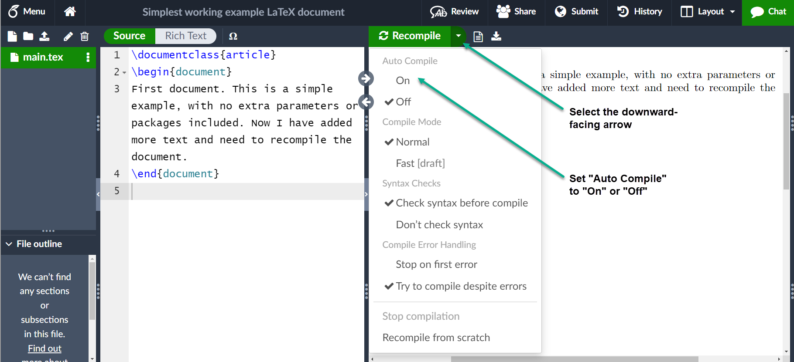

# Learn LaTeX in 30 minutes

> **NEW:** Visit the new [Overleaf Learning Center](https://learn.overleaf.com/) to explore free online courses and live webinars — everything you need to master LaTeX and get the most out of Overleaf.

This introductory tutorial does not assume any prior experience of LaTeX but, hopefully, by the time you are finished, you will not only have written your first LaTeX document but also acquired sufficient knowledge and confidence to take the next steps toward LaTeX proficiency.

## What is LaTeX?

LaTeX (pronounced “_LAY_-tek” or “_LAH_-tek”) is a tool for typesetting professional-looking documents. However, LaTeX’s mode of operation is quite different to many other document-production applications you may have used, such as Microsoft Word or LibreOffice Writer: those “[WYSIWYG](https://en.wikipedia.org/wiki/WYSIWYG)” tools provide users with an interactive page into which they type and edit their text and apply various forms of styling. LaTeX works very differently: instead, your document is a plain text file interspersed with LaTeX _commands_ used to express the desired (typeset) results. To produce a visible, typeset document, your LaTeX file is processed by a piece of software called a _TeX engine_ which uses the commands embedded in your text file to guide and control the typesetting process, converting the LaTeX commands and document text into a professionally typeset PDF file. This means you only need to focus on the _content_ of your document and the computer, via LaTeX commands and the TeX engine, will take care of the _visual appearance_ (formatting).

## Why learn LaTeX?

Various arguments can be proposed for, or against, learning to use LaTeX instead of other document-authoring applications; but, ultimately, it is a personal choice based on preferences, affinities, and documentation requirements.

Arguments in favour of LaTeX include:

* support for typesetting extremely complex mathematics, tables and technical content for the physical sciences;
* facilities for footnotes, cross-referencing and management of bibliographies;
* ease of producing complicated, or tedious, document elements such as indexes, glossaries, table of contents, lists of figures;
* being highly customizable for bespoke document production due to its intrinsic programmability and extensibility through thousands of [free add-on packages](https://www.ctan.org/pkg).

Overall, LaTeX provides users with a great deal of control over the production of documents which are typeset to extremely high standards. Of course, there are types of documents or publications where LaTeX doesn’t shine, including many “free form” page designs typically found in magazine-type publications.

One important benefit of LaTeX is the separation of document content from document style: once you have written the content of your document, its appearance can be changed with ease. Similarly, you can create a LaTeX file which defines the layout/style of a particular document type and that file can be used as a _template_ to standardise authorship/production of additional documents of that type; for example, this allows scientific publishers to create article templates, in LaTeX, which authors use to write papers for submission to journals. Overleaf has a [gallery containing thousands of templates](https://www.overleaf.com/gallery), covering an enormous range of document types—everything from scientific articles, reports and books to CVs and presentations. Because these templates define the layout and style of the document, authors need only to open them in Overleaf—creating a new project—and commence writing to add their content.

## Writing your first piece of LaTeX

The first step is to create a new LaTeX project. You can do this on your own computer by creating a new `.tex` file; alternatively, you can [start a new project in Overleaf](/broken/pages/2810b15fbccb03f26524960e1c35a13f9a8de912).

Let’s start with the simplest working example, which can be opened directly in Overleaf:

```latex
\documentclass{article}
\begin{document}
First document. This is a simple example, with no 
extra parameters or packages included.
\end{document}
```

[Open this example in Overleaf.](https://www.overleaf.com/docs?engine=pdflatex\&snip%5Fname=Simplest+working+example+LaTeX+document\&snip=%5Cdocumentclass%7Barticle%7D%0A%5Cbegin%7Bdocument%7D%0AFirst+document.+This+is+a+simple+example%2C+with+no+%0Aextra+parameters+or+packages+included.%0A%5Cend%7Bdocument%7D)

This example produces the following output:


You can see that LaTeX has automatically indented the first line of the paragraph, taking care of that formatting for you. Let’s have a closer look at what each part of our code does.

The first line of code, `\documentclass{article}`, declares the document type known as its _class_, which controls the overall appearance of the document. Different types of documents require different classes; i.e., a CV/resume will require a different class than a scientific paper which might use the standard LaTeX `article` class. Other types of documents you may be working on may require different classes such as `book` or `report`. To get some idea of the many LaTeX class types available, [visit the relevant page on CTAN (Comprehensive TeX Archive Network)](https://www.ctan.org/topic/class).

Having set the document class, our content, known as the _body_ of the document, is written between the `\begin{document}` and `\end{document}` tags. After opening the example above, you can make changes to the text and, when finished, view the resulting typeset PDF by _recompiling the document_. To do this in Overleaf, simply hit **Recompile**, as demonstrated in this brief video clip:

Any Overleaf project can be configured to recompile automatically each time it is edited: click the small arrow next to the **Recompile** button and set **Auto Compile** to **On**, as shown in the following screengrab:



Having seen how to add content to our document, the next step is to give it a title. To do this, we must talk briefly about the **preamble**.

## The preamble of a document

The screengrab above shows Overleaf storing a LaTeX document as a file called `main.tex`: the `.tex` file extension is, by convention, used when naming files containing your document’s LaTeX code.

The previous example showed how document content was entered after the `\begin{document}` command; however, everything in your `.tex` file appearing _before_ that point is called the _preamble_, which acts as the document’s “setup” section. Within the preamble you define the document class (type) together with specifics such as languages to be used when writing the document; loading _packages_ you would like to use (more on this [later](learn-latex-in-30-minutes.md#Finding%5Fand%5Fusing%5FLaTeX%5Fpackages)), and it is where you’d apply other types of configuration.

A minimal document preamble might look like this:

```latex
\documentclass[12pt, letterpaper]{article}
\usepackage{graphicx}
```

where `\documentclass[12pt, letterpaper]{article}` defines the overall class (type) of document. Additional parameters, which must be separated by commas, are included in square brackets (`[...]`) and used to configure this instance of the article class; i.e., settings we wish to use for this particular `article`-class-based document.

In this example, the two parameters do the following:

* `12pt` sets the font size
* `letterpaper` sets the paper size

Of course other font sizes, `9pt`, `11pt`, `12pt`, can be used, but if none is specified, the default size is `10pt`. As for the paper size, other possible values are `a4paper` and `legalpaper`. For further information see the article about [page size and margins](/broken/pages/79cd17a7ad08032960e36b2398861a6c043efa0b).

The preamble line

```latex
\usepackage{graphicx}
```

is an example of loading an external package (here, [graphicx](https://ctan.org/pkg/graphicx?lang=en)) to extend LaTeX’s capabilities, enabling it to import external graphics files. LaTeX packages are discussed in the section [Finding and using LaTeX packages](learn-latex-in-30-minutes.md#Finding%5Fand%5Fusing%5FLaTeX%5Fpackages).

## Including title, author and date information

Adding a title, author and date to our document requires three more lines in the _preamble_ (_not_ the main body of the document). Those lines are:

* `\title{My first LaTeX document}`: the document title
* `\author{Hubert Farnsworth}`: here you write the name of the author(s) and, optionally, the `\thanks` command within the curly braces:
  * `\thanks{Funded by the Overleaf team.}`: can be added after the name of the author, inside the braces of the `author` command. It will add a superscript and a footnote with the text inside the braces. Useful if you need to thank an institution in your article.
* `\date{August 2022}`: you can enter the date manually or use the command `\today` to typeset the current date every time the document is compiled

With these lines added, your preamble should look something like this:

```latex
\documentclass[12pt, letterpaper]{article}
\title{My first LaTeX document}
\author{Hubert Farnsworth\thanks{Funded by the Overleaf team.}}
\date{August 2022}
```

To typeset the title, author and date use the `\maketitle` command within the _body_ of the document:

```latex
\begin{document}
\maketitle
We have now added a title, author and date to our first \LaTeX{} document!
\end{document}
```

The preamble and body can now be combined to produce a complete document which can be opened in Overleaf:

```latex
\documentclass[12pt, letterpaper]{article}
\title{My first LaTeX document}
\author{Hubert Farnsworth\thanks{Funded by the Overleaf team.}}
\date{August 2022}
\begin{document}
\maketitle
We have now added a title, author and date to our first \LaTeX{} document!
\end{document}
```

[Open this example in Overleaf.](https://www.overleaf.com/docs?engine=pdflatex\&snip%5Fname=My+first+LaTeX+document\&snip=%5Cdocumentclass%5B12pt%2C+letterpaper%5D%7Barticle%7D%0A%5Ctitle%7BMy+first+LaTeX+document%7D%0A%5Cauthor%7BHubert+Farnsworth%5Cthanks%7BFunded+by+the+Overleaf+team.%7D%7D%0A%5Cdate%7BAugust+2022%7D%0A%5Cbegin%7Bdocument%7D%0A%5Cmaketitle%0AWe+have+now+added+a+title%2C+author+and+date+to+our+first+%5CLaTeX%7B%7D+document%21%0A%5Cend%7Bdocument%7D)

This example produces the following output:


## Adding comments

LaTeX is a form of “program code”, but one which specializes in document typesetting; consequently, as with code written in any other programming language, it can be very useful to include comments within your document. A LaTeX comment is a section of text that will not be typeset or affect the document in any way—often used to add “to do” notes; include explanatory notes; provide in-line explanations of tricky macros or comment-out lines/sections of LaTeX code when debugging.

To make a comment in LaTeX, simply write a `%` symbol at the beginning of the line, as shown in the following code which uses the example above:

```latex
\documentclass[12pt, letterpaper]{article}
\title{My first LaTeX document}
\author{Hubert Farnsworth\thanks{Funded by the Overleaf team.}}
\date{August 2022}
\begin{document}
\maketitle
We have now added a title, author and date to our first \LaTeX{} document!

% This line here is a comment. It will not be typeset in the document.
\end{document}
```

[Open this example in Overleaf.](https://www.overleaf.com/docs?engine=pdflatex\&snip%5Fname=My+first+LaTeX+document+with+a+comment\&snip=%5Cdocumentclass%5B12pt%2C+letterpaper%5D%7Barticle%7D%0A%5Ctitle%7BMy+first+LaTeX+document%7D%0A%5Cauthor%7BHubert+Farnsworth%5Cthanks%7BFunded+by+the+Overleaf+team.%7D%7D%0A%5Cdate%7BAugust+2022%7D%0A%5Cbegin%7Bdocument%7D%0A%5Cmaketitle%0AWe+have+now+added+a+title%2C+author+and+date+to+our+first+%5CLaTeX%7B%7D+document%21%0A%0A%25+This+line+here+is+a+comment.+It+will+not+be+typeset+in+the+document.%0A%5Cend%7Bdocument%7D)

This example produces output that is identical to the previous LaTeX code which did not contain the comment.

## Bold, italics and underlining

Next, we will now look at some text formatting commands:

* **Bold**: bold text in LaTeX is typeset using the `\textbf{...}` command.
* _Italics_: italicised text is produced using the `\textit{...}` command.
* Underline: to underline text use the `\underline{...}` command.

The next example demonstrates these commands:

```latex
Some of the \textbf{greatest}
discoveries in \underline{science} 
were made by \textbf{\textit{accident}}.
```

[Open this example in Overleaf.](https://www.overleaf.com/docs?engine=pdflatex\&snip%5Fname=First+example+with+formatted+text\&snip=%5Cdocumentclass%5B12pt%2C+letterpaper%5D%7Barticle%7D%0A%5Ctitle%7BMy+first+LaTeX+document%7D%0A%5Cauthor%7BHubert+Farnsworth%5Cthanks%7BFunded+by+the+Overleaf+team.%7D%7D%0A%5Cdate%7BAugust+2022%7D%0A%5Cbegin%7Bdocument%7D%0A%5Cmaketitle%0ASome+of+the+%5Ctextbf%7Bgreatest%7D%0Adiscoveries+in+%5Cunderline%7Bscience%7D+%0Awere+made+by+%5Ctextbf%7B%5Ctextit%7Baccident%7D%7D.%0A%5Cend%7Bdocument%7D)

This example produces the following output:


Another very useful command is `\emph{_argument_}`, whose effect on its `_argument_` depends on the context. Inside normal text, the emphasized text is italicized, but this behaviour is reversed if used inside an italicized text—see the next example:

```latex
Some of the greatest \emph{discoveries} in science 
were made by accident.

\textit{Some of the greatest \emph{discoveries} 
in science were made by accident.}

\textbf{Some of the greatest \emph{discoveries} 
in science were made by accident.}
```

[Open this **\emph** example in Overleaf.](https://www.overleaf.com/docs?engine=pdflatex\&snip%5Fname=Using+the+emph+command\&snip=%5Cdocumentclass%5B12pt%2C+letterpaper%5D%7Barticle%7D%0A%5Ctitle%7BMy+first+LaTeX+document%7D%0A%5Cauthor%7BHubert+Farnsworth%5Cthanks%7BFunded+by+the+Overleaf+team.%7D%7D%0A%5Cdate%7BAugust+2022%7D%0A%5Cbegin%7Bdocument%7D%0A%5Cparindent0pt%25+To+remove+the+paragraph+indentation%0A%5Cmaketitle%0ASome+of+the+greatest+%5Cemph%7Bdiscoveries%7D+in+science+%0Awere+made+by+accident.%0A%0A%5Ctextit%7BSome+of+the+greatest+%5Cemph%7Bdiscoveries%7D+%0Ain+science+were+made+by+accident.%7D%0A%0A%5Ctextbf%7BSome+of+the+greatest+%5Cemph%7Bdiscoveries%7D+%0Ain+science+were+made+by+accident.%7D%0A%5Cend%7Bdocument%7D)

This example produces the following output:


* **Note:** some packages, such as [Beamer](/broken/pages/caaaeec1e22b63e51a60d21e3de40aac40c37421), change the behaviour of the `\emph` command.

## Adding images

In this section we will look at how to add images to a LaTeX document. Overleaf supports three ways to insert images:

1. Use the [**Insert Figure** button](https://learn.overleaf.com/learn/Kb/How_to_insert_figures_in_Overleaf#Using%5FInsert%5FFigure%5Fto%5Fadd%5Fa%5Ffigure%5Fto%5Fyour%5Fproject)(), located on the editor toolbar, to insert an image into **Visual Editor** or **Code Editor**.
2. [Copy and paste an image](/broken/pages/a6becd7f08fa8f8358ac998fa80d16399039d4ec) into **Visual Editor** or **Code Editor**.
3. Use **Code Editor** to write LaTeX code that inserts a graphic.

Options 1 and 2 automatically generate the LaTeX code required to insert images, but here we introduce option 3—note that you will need to [upload those images](https://docs.overleaf.com/writing-and-editing/inserting-images) to your Overleaf project. The following example demonstrates how to include a picture:

```latex
\documentclass{article}
\usepackage{graphicx} %LaTeX package to import graphics
\graphicspath{{images/}} %configuring the graphicx package
 
\begin{document}
The universe is immense and it seems to be homogeneous, 
on a large scale, everywhere we look.

% The \includegraphics command is 
% provided (implemented) by the 
% graphicx package
\includegraphics{universe}  
 
There's a picture of a galaxy above.
\end{document}
```

[Open this image example in Overleaf.](https://www.overleaf.com/project/new/template/25686?id=107971142\&templateName=Example+using+images+in+LaTeX\&latexEngine=pdflatex\&texImage=texlive-full%3A2022.1\&mainFile=)

This example produces the following output:


Importing graphics into a LaTeX document needs [an add-on _package_](learn-latex-in-30-minutes.md#Finding%5Fand%5Fusing%5FLaTeX%5Fpackages) which provides the commands and features required to include external graphics files. The above example loads the [graphicx package](https://ctan.org/pkg/graphicx?lang=en) which, among many other commands, provides `\includegraphics{...}` to import graphics and `\graphicspath{...}` to advise LaTeX where the graphics are located.

To use the `graphicx` package, include the following line in your Overleaf document preamble:

```latex
\usepackage{graphicx}
```

In our example the command `\graphicspath{{images/}}` informs LaTeX that images are kept in a folder named `images`, which is contained in the current directory:


The `\includegraphics{universe}` command does the actual work of inserting the image in the document. Here, `universe` is the name of the image file but without its extension.

**Note**:

* Although the full file name, including its extension, is allowed in the `\includegraphics` command, it’s considered best practice to omit the file extension because it will prompt LaTeX to search for all the supported formats.
* Generally, the graphic’s file name should not contain white spaces or multiple dots; it is also recommended to use lowercase letters for the file extension when uploading image files to Overleaf.

More information on LaTeX packages can be found at the end of this tutorial in the section [Finding and using LaTeX packages](learn-latex-in-30-minutes.md#Finding%5Fand%5Fusing%5FLaTeX%5Fpackages).

## Captions, labels and references

Images can be captioned, labelled and referenced by means of the `figure` environment, as shown below:

```latex
\documentclass{article}
\usepackage{graphicx}
\graphicspath{{images/}}
 
\begin{document}

\begin{figure}[h]
    \centering
    \includegraphics[width=0.75\textwidth]{mesh}
    \caption{A nice plot.}
    \label{fig:mesh1}
\end{figure}
 
As you can see in figure \ref{fig:mesh1}, the function grows near the origin. This example is on page \pageref{fig:mesh1}.

\end{document}
```

[Open this image example in Overleaf.](https://www.overleaf.com/project/new/template/25519?id=107980830\&templateName=Example+using+image+captions+in+LaTeX\&latexEngine=pdflatex\&texImage=texlive-full%3A2022.1\&mainFile=)

This example produces the following output:


There are several noteworthy commands in the example:

* **`\includegraphics[width=0.75\textwidth]{mesh}`**: This form of `\includegraphics` instructs LaTeX to set the figure’s width to 75% of the text width—whose value is stored in the `\textwidth` command.
* **`\caption{A nice plot.}`**: As its name suggests, this command sets the figure caption which can be placed above or below the figure. If you create a list of figures this caption will be used in that list.
* **`\label{fig:mesh1}`**: To reference this image within your document you give it a label using the `\label` command. The label is used to generate a number for the image and, combined with the next command, will allow you to reference it.
* **`\ref{fig:mesh1}`**: This code will be substituted by the number corresponding to the referenced figure.

Images incorporated in a LaTeX document should be placed inside a `figure` environment, or similar, so that LaTeX can automatically position the image at a suitable location in your document.

Further guidance is contained in the following Overleaf help articles:

* [Positioning of Figures](/broken/pages/43a8fb4e723cace2082c3b99398d2c46c42e8a4f)
* [Inserting Images](https://docs.overleaf.com/writing-and-editing/inserting-images)

## Creating lists in LaTeX

You can create different types of list using _environments_, which are used to encapsulate the LaTeX code required to implement a specific typesetting feature. An environment starts with `\begin{_environment-name_}` and ends with `\end{_environment-name_}` where `_environment-name_` might be `figure`, `tabular` or one of the list types: `itemize` for unordered lists or `enumerate` for ordered lists.

### Unordered lists

Unordered lists are produced by the `itemize` environment. Each list entry must be preceded by the `\item` command, as shown below:

```latex
\documentclass{article}
\begin{document}
\begin{itemize}
  \item The individual entries are indicated with a black dot, a so-called bullet.
  \item The text in the entries may be of any length.
\end{itemize}
\end{document}
```

[Open this example in Overleaf.](https://www.overleaf.com/docs?engine=pdflatex\&snip%5Fname=Example+of+a+LaTeX+unordered+list\&snip=%5Cdocumentclass%7Barticle%7D%0A%5Cbegin%7Bdocument%7D%0A%5Cbegin%7Bitemize%7D%0A++%5Citem+The+individual+entries+are+indicated+with+a+black+dot%2C+a+so-called+bullet.%0A++%5Citem+The+text+in+the+entries+may+be+of+any+length.%0A%5Cend%7Bitemize%7D%0A%5Cend%7Bdocument%7D)

This example produces the following output:


You can also open this [larger Overleaf project](https://www.overleaf.com/project/new/template/25521?id=107987258\&templateName=Demonstrating+various+types+of+LaTeX+list\&latexEngine=pdflatex\&texImage=texlive-full%3A2022.1\&mainFile=) which demonstrates various types of LaTeX list.

### Ordered lists

Ordered lists use the same syntax as unordered lists but are created using the `enumerate` environment:

```latex
\documentclass{article}
\begin{document}
\begin{enumerate}
  \item This is the first entry in our list.
  \item The list numbers increase with each entry we add.
\end{enumerate}
\end{document}
```

[Open this example in Overleaf.](https://www.overleaf.com/docs?engine=pdflatex\&snip%5Fname=Example+of+the+enumerate+environment\&snip=%5Cdocumentclass%7Barticle%7D%0A%5Cbegin%7Bdocument%7D%0A%5Cbegin%7Benumerate%7D%0A++%5Citem+This+is+the+first+entry+in+our+list.%0A++%5Citem+The+list+numbers+increase+with+each+entry+we+add.%0A%5Cend%7Benumerate%7D%0A%5Cend%7Bdocument%7D)

This example produces the following output:


As with `unordered` lists, each entry must be preceded by the `\item` command which, here, automatically generates the numeric ordered-list label value, starting at 1.

For further information you can open this [larger Overleaf project](https://www.overleaf.com/project/new/template/25521?id=107987258\&templateName=Demonstrating+various+types+of+LaTeX+list\&latexEngine=pdflatex\&texImage=texlive-full%3A2022.1\&mainFile=) which demonstrates various types of LaTeX list or visit our dedicated [help article on LaTeX lists](/broken/pages/43fcbbc93cc98589b1579302c0ab2a46ab26a3c3), which provides many more examples and shows how to create customized lists.

## Adding math to LaTeX

One of the main advantages of LaTeX is the ease with which mathematical expressions can be written. LaTeX provides two writing modes for typesetting mathematics:

* _inline_ math mode used for writing formulas that are part of a paragraph
* _display_ math mode used to write expressions that are not part of a text or paragraph and are typeset on separate lines

### Inline math mode

Let’s see an example of inline math mode:

```latex
\documentclass[12pt, letterpaper]{article}
\begin{document}
In physics, the mass-energy equivalence is stated 
by the equation $E=mc^2$, discovered in 1905 by Albert Einstein.
\end{document}
```

[Open this example in Overleaf.](https://www.overleaf.com/docs?engine=pdflatex\&snip%5Fname=Inline+LaTeX+maths+example\&snip=%5Cdocumentclass%5B12pt%2C+letterpaper%5D%7Barticle%7D%0A%5Cbegin%7Bdocument%7D%0AIn+physics%2C+the+mass-energy+equivalence+is+stated+%0Aby+the+equation+%24E%3Dmc%5E2%24%2C+discovered+in+1905+by+Albert+Einstein.%0A%5Cend%7Bdocument%7D)

This example produces the following output:


To typeset inline-mode math you can use one of these delimiter pairs: `\( ... \)`, `$ ... $` or `\begin{math} ... \end{math}`, as demonstrated in the following example:

```latex
\documentclass[12pt, letterpaper]{article}
\begin{document}
\begin{math}
E=mc^2
\end{math} is typeset in a paragraph using inline math mode---as is $E=mc^2$, and so too is \(E=mc^2\).
\end{document}
```

[Open this example in Overleaf.](https://www.overleaf.com/docs?engine=pdflatex\&snip%5Fname=Demonstrating+inline+math+mode\&snip=%5Cdocumentclass%5B12pt%2C+letterpaper%5D%7Barticle%7D%0A%5Cbegin%7Bdocument%7D%0A%5Cbegin%7Bmath%7D%0AE%3Dmc%5E2%0A%5Cend%7Bmath%7D+is+typeset+in+a+paragraph+using+inline+math+mode---as+is+%24E%3Dmc%5E2%24%2C+and+so+too+is+%5C%28E%3Dmc%5E2%5C%29.%0A%5Cend%7Bdocument%7D)

This example produces the following output:


### Display math mode

Equations typeset in display mode can be numbered or unnumbered, as in the following example:

```latex
\documentclass[12pt, letterpaper]{article}
\begin{document}
The mass-energy equivalence is described by the famous equation
\[ E=mc^2 \] discovered in 1905 by Albert Einstein. 

In natural units ($c = 1$), the formula expresses the identity
\begin{equation}
E=m
\end{equation}
\end{document}
```

[Open this example in Overleaf.](https://www.overleaf.com/docs?engine=pdflatex\&snip%5Fname=Display+math+mode+example\&snip=%5Cdocumentclass%5B12pt%2C+letterpaper%5D%7Barticle%7D%0A%5Cbegin%7Bdocument%7D%0AThe+mass-energy+equivalence+is+described+by+the+famous+equation%0A%5C%5B+E%3Dmc%5E2+%5C%5D+discovered+in+1905+by+Albert+Einstein.+%0A%0AIn+natural+units+%28%24c+%3D+1%24%29%2C+the+formula+expresses+the+identity%0A%5Cbegin%7Bequation%7D%0AE%3Dm%0A%5Cend%7Bequation%7D%0A%5Cend%7Bdocument%7D)

This example produces the following output:


To typeset display-mode math you can use one of these delimiter pairs: `\[ ... \]`, `\begin{displaymath} ... \end{displaymath}` or `\begin{equation} ... \end{equation}`. Historically, typesetting display-mode math required use of `$$` characters delimiters, as in `$$ _... display math here ..._$$`, but this method [is no longer recommended](https://texfaq.org/FAQ-dolldoll): use LaTeX’s delimiters `\[ ... \]` instead.

### More complete examples

The following examples demonstrate a range of mathematical content typeset using LaTeX.

```latex
\documentclass{article}
\begin{document}
Subscripts in math mode are written as $a_b$ and superscripts are written as $a^b$. These can be combined and nested to write expressions such as

\[ T^{i_1 i_2 \dots i_p}_{j_1 j_2 \dots j_q} = T(x^{i_1},\dots,x^{i_p},e_{j_1},\dots,e_{j_q}) \]
 
We write integrals using $\int$ and fractions using $\frac{a}{b}$. Limits are placed on integrals using superscripts and subscripts:

\[ \int_0^1 \frac{dx}{e^x} =  \frac{e-1}{e} \]

Lower case Greek letters are written as $\omega$ $\delta$ etc. while upper case Greek letters are written as $\Omega$ $\Delta$.

Mathematical operators are prefixed with a backslash as $\sin(\beta)$, $\cos(\alpha)$, $\log(x)$ etc.
\end{document}
```

[Open this example in Overleaf.](https://www.overleaf.com/docs?engine=pdflatex\&snip%5Fname=More+advanced+LaTeX+math+example\&snip=%5Cdocumentclass%7Barticle%7D%0A%5Cbegin%7Bdocument%7D%0ASubscripts+in+math+mode+are+written+as+%24a%5Fb%24+and+superscripts+are+written+as+%24a%5Eb%24.+These+can+be+combined+and+nested+to+write+expressions+such+as%0A%0A%5C%5B+T%5E%7Bi%5F1+i%5F2+%5Cdots+i%5Fp%7D%5F%7Bj%5F1+j%5F2+%5Cdots+j%5Fq%7D+%3D+T%28x%5E%7Bi%5F1%7D%2C%5Cdots%2Cx%5E%7Bi%5Fp%7D%2Ce%5F%7Bj%5F1%7D%2C%5Cdots%2Ce%5F%7Bj%5Fq%7D%29+%5C%5D%0A+%0AWe+write+integrals+using+%24%5Cint%24+and+fractions+using+%24%5Cfrac%7Ba%7D%7Bb%7D%24.+Limits+are+placed+on+integrals+using+superscripts+and+subscripts%3A%0A%0A%5C%5B+%5Cint%5F0%5E1+%5Cfrac%7Bdx%7D%7Be%5Ex%7D+%3D++%5Cfrac%7Be-1%7D%7Be%7D+%5C%5D%0A%0ALower+case+Greek+letters+are+written+as+%24%5Comega%24+%24%5Cdelta%24+etc.+while+upper+case+Greek+letters+are+written+as+%24%5COmega%24+%24%5CDelta%24.%0A%0AMathematical+operators+are+prefixed+with+a+backslash+as+%24%5Csin%28%5Cbeta%29%24%2C+%24%5Ccos%28%5Calpha%29%24%2C+%24%5Clog%28x%29%24+etc.%0A%5Cend%7Bdocument%7D)

This example produces the following output:


The next example uses the `equation*` environment which is provided by the `amsmath` package, so we need to add the following line to our document preamble:

```latex
\usepackage{amsmath}% For the equation* environment
```

For further information on using `amsmath` see [our help article](/broken/pages/d5f40264ff8c2af9c6c0b08858b28ea4f2c23df6).

```latex
\documentclass{article}
\usepackage{amsmath}% For the equation* environment
\begin{document}
\section{First example}

The well-known Pythagorean theorem \(x^2 + y^2 = z^2\) was proved to be invalid for other exponents, meaning the next equation has no integer solutions for \(n>2\):

\[ x^n + y^n = z^n \]

\section{Second example}

This is a simple math expression \(\sqrt{x^2+1}\) inside text. 
And this is also the same: 
\begin{math}
\sqrt{x^2+1}
\end{math}
but by using another command.

This is a simple math expression without numbering
\[\sqrt{x^2+1}\] 
separated from text.

This is also the same:
\begin{displaymath}
\sqrt{x^2+1}
\end{displaymath}

\ldots and this:
\begin{equation*}
\sqrt{x^2+1}
\end{equation*}
\end{document}
```

[Open this example in Overleaf.](https://www.overleaf.com/docs?engine=pdflatex\&snip%5Fname=More+math+content+typeset+in+LaTeX\&snip=%5Cdocumentclass%7Barticle%7D%0A%5Cusepackage%7Bamsmath%7D%25+For+the+equation%2A+environment%0A%5Cbegin%7Bdocument%7D%0A%5Csection%7BFirst+example%7D%0A%0AThe+well-known+Pythagorean+theorem+%5C%28x%5E2+%2B+y%5E2+%3D+z%5E2%5C%29+was+proved+to+be+invalid+for+other+exponents%2C+meaning+the+next+equation+has+no+integer+solutions+for+%5C%28n%3E2%5C%29%3A%0A%0A%5C%5B+x%5En+%2B+y%5En+%3D+z%5En+%5C%5D%0A%0A%5Csection%7BSecond+example%7D%0A%0AThis+is+a+simple+math+expression+%5C%28%5Csqrt%7Bx%5E2%2B1%7D%5C%29+inside+text.+%0AAnd+this+is+also+the+same%3A+%0A%5Cbegin%7Bmath%7D%0A%5Csqrt%7Bx%5E2%2B1%7D%0A%5Cend%7Bmath%7D%0Abut+by+using+another+command.%0A%0AThis+is+a+simple+math+expression+without+numbering%0A%5C%5B%5Csqrt%7Bx%5E2%2B1%7D%5C%5D+%0Aseparated+from+text.%0A%0AThis+is+also+the+same%3A%0A%5Cbegin%7Bdisplaymath%7D%0A%5Csqrt%7Bx%5E2%2B1%7D%0A%5Cend%7Bdisplaymath%7D%0A%0A%5Cldots+and+this%3A%0A%5Cbegin%7Bequation%2A%7D%0A%5Csqrt%7Bx%5E2%2B1%7D%0A%5Cend%7Bequation%2A%7D%0A%5Cend%7Bdocument%7D)

This example produces the following output:


The possibilities with math in LaTeX are endless so be sure to visit our help pages for advice and examples on specific topics:

* [Mathematical expressions](/broken/pages/6b8d2e45ccdc0e9e9b48e6e36be0fa67bebb8e69)
* [Subscripts and superscripts](/broken/pages/f019fbc3a30e875f0f6b40918660f0f298e131e2)
* [Brackets and Parentheses](/broken/pages/dc385c95377346756a67fda393d5dc6e4aca381e)
* [Fractions and Binomials](/broken/pages/9ad05aabb960b61c0bd3f15fb3e267ea50ea51d4)
* [Aligning Equations](/broken/pages/c8c9f615db0d1888603b6e6aa95d96e99406f7c4)
* [Operators](/broken/pages/619c813ae8475fdfb9acda97df2d923c4ade4fcb)
* [Spacing in math mode](/broken/pages/1aa7e698d9af27eb4f2d809548badfb7d3815c29)
* [Integrals, sums and limits](/broken/pages/3e16d4f33baba6829b35989abd459961878f6acb)
* [Display style in math mode](/broken/pages/6b6015c90a5e2b500012ea8a3bfc82adbe151011)
* [List of Greek letters and math symbols](/broken/pages/936480f1d22ca97bc4220430ac5c73f1fd7eca5e)
* [Mathematical fonts](/broken/pages/57fa7e01b8f0f42ad564f16d7ccc2a12926276c4)

## Basic document structure

Next, we explore abstracts and how to partition a LaTeX document into different chapters, sections and paragraphs.

### Abstracts

Scientific articles usually provide an _abstract_ which is a brief overview/summary of their core topics, or arguments. The next example demonstrates typesetting an abstract using LaTeX’s `abstract` environment:

```latex
\documentclass{article}
\begin{document}
\begin{abstract}
This is a simple paragraph at the beginning of the 
document. A brief introduction about the main subject.
\end{abstract}
\end{document}
```

[Open this example in Overleaf.](https://www.overleaf.com/docs?engine=pdflatex\&snip%5Fname=How+to+create+a+document+abstract\&snip=%5Cdocumentclass%7Barticle%7D%0A%5Cbegin%7Bdocument%7D%0A%5Cbegin%7Babstract%7D%0AThis+is+a+simple+paragraph+at+the+beginning+of+the+%0Adocument.+A+brief+introduction+about+the+main+subject.%0A%5Cend%7Babstract%7D%0A%5Cend%7Bdocument%7D)

This example produces the following output:


### Paragraphs and new lines

With the abstract in place, we can begin writing our first paragraph. The next example demonstrates:

* how a new paragraph is created by pressing the "enter" key twice, ending the current line and inserting a subsequent blank line;
* how to start a new line without starting a new paragraph by inserting a manual line break using the `\\` command, which is a double backslash; alternatively, use the `\newline` command.

The third paragraph in this example demonstrates use of the commands `\\` and `\newline`:

```latex
\documentclass{article}
\begin{document}

\begin{abstract}
This is a simple paragraph at the beginning of the 
document. A brief introduction about the main subject.
\end{abstract}

After our abstract we can begin the first paragraph, then press ``enter'' twice to start the second one.

This line will start a second paragraph.

I will start the third paragraph and then add \\ a manual line break which causes this text to start on a new line but remains part of the same paragraph. Alternatively, I can use the \verb|\newline|\newline command to start a new line, which is also part of the same paragraph.
\end{document}
```

[Open this example in Overleaf.](https://www.overleaf.com/docs?engine=pdflatex\&snip%5Fname=Example+to+create+a+new+paragraph\&snip=%5Cdocumentclass%7Barticle%7D%0A%5Cbegin%7Bdocument%7D%0A%0A%5Cbegin%7Babstract%7D%0AThis+is+a+simple+paragraph+at+the+beginning+of+the+%0Adocument.+A+brief+introduction+about+the+main+subject.%0A%5Cend%7Babstract%7D%0A%0AAfter+our+abstract+we+can+begin+the+first+paragraph%2C+then+press+%60%60enter%27%27+twice+to+start+the+second+one.%0A%0AThis+line+will+start+a+second+paragraph.%0A%0AI+will+start+the+third+paragraph+and+then+add+%5C%5C+a+manual+line+break+which+causes+this+text+to+start+on+a+new+line+but+remains+part+of+the+same+paragraph.+Alternatively%2C+I+can+use+the+%5Cverb%7C%5Cnewline%7C%5Cnewline+command+to+start+a+new+line%2C+which+is+also+part+of+the+same+paragraph.%0A%5Cend%7Bdocument%7D)

This example produces the following output:


Note how LaTeX automatically indents paragraphs—except immediately after document headings such as section and subsection—[as we will see](learn-latex-in-30-minutes.md#Chapters%5Fand%5Fsections).

New users are advised that multiple `\\` or `\newline`s should not be used to “simulate” paragraphs with larger spacing between them because this can interfere with LaTeX’s typesetting algorithms. The recommended method is to continue using blank lines for creating new paragraphs, without any `\\`, and load the [parskip package](https://ctan.org/pkg/parskip?lang=en) by adding `\usepackage{parskip}` to the preamble.

Further information on paragraphs can be found in the following articles:

* [Paragraphs and new lines](/broken/pages/161011875ee5a1d89a5ce6ba0cf4c2f48ccad63c)
* [How to change paragraph spacing in LaTeX](/broken/pages/2e78cff877e9f922ae88638dec6d04d98306464a)
* [LaTeX Error: There's no line here to end](/broken/pages/34191766f1a3ea0d2a9043c802decff2624e9c32) provides additional advice and guidance on using `\\`.

### Chapters and sections

Longer documents, irrespective of authoring software, are usually partitioned into parts, chapters, sections, subsections and so forth. LaTeX also provides document-structuring commands but the available commands, and their implementations (what they do), can depend on the document class being used. By way of example, documents created using the `book` class can be split into parts, chapters, sections, subsections and so forth but the `letter` class does not provide (support) any commands to do that.

This next example demonstrates commands used to structure a document based on the `book` class:

```latex
\documentclass{book}
\begin{document}

\chapter{First Chapter}

\section{Introduction}

This is the first section.

Lorem  ipsum  dolor  sit  amet,  consectetuer  adipiscing  
elit. Etiam  lobortisfacilisis sem.  Nullam nec mi et 
neque pharetra sollicitudin.  Praesent imperdietmi nec ante. 
Donec ullamcorper, felis non sodales...

\section{Second Section}

Lorem ipsum dolor sit amet, consectetuer adipiscing elit.  
Etiam lobortis facilisissem.  Nullam nec mi et neque pharetra 
sollicitudin.  Praesent imperdiet mi necante...

\subsection{First Subsection}
Praesent imperdietmi nec ante. Donec ullamcorper, felis non sodales...

\section*{Unnumbered Section}
Lorem ipsum dolor sit amet, consectetuer adipiscing elit.  
Etiam lobortis facilisissem...
\end{document}
```

[Open this example in Overleaf.](https://www.overleaf.com/docs?engine=pdflatex\&snip%5Fname=Book+class+example+document\&snip=%5Cdocumentclass%7Bbook%7D%0A%5Cbegin%7Bdocument%7D%0A%0A%5Cchapter%7BFirst+Chapter%7D%0A%0A%5Csection%7BIntroduction%7D%0A%0AThis+is+the+first+section.%0A%0ALorem++ipsum++dolor++sit++amet%2C++consectetuer++adipiscing++%0Aelit.+Etiam++lobortisfacilisis+sem.++Nullam+nec+mi+et+%0Aneque+pharetra+sollicitudin.++Praesent+imperdietmi+nec+ante.+%0ADonec+ullamcorper%2C+felis+non+sodales...%0A%0A%5Csection%7BSecond+Section%7D%0A%0ALorem+ipsum+dolor+sit+amet%2C+consectetuer+adipiscing+elit.++%0AEtiam+lobortis+facilisissem.++Nullam+nec+mi+et+neque+pharetra+%0Asollicitudin.++Praesent+imperdiet+mi+necante...%0A%0A%5Csubsection%7BFirst+Subsection%7D%0APraesent+imperdietmi+nec+ante.+Donec+ullamcorper%2C+felis+non+sodales...%0A%0A%5Csection%2A%7BUnnumbered+Section%7D%0ALorem+ipsum+dolor+sit+amet%2C+consectetuer+adipiscing+elit.++%0AEtiam+lobortis+facilisissem...%0A%5Cend%7Bdocument%7D)

This example produces the following output:


The names of sectioning commands are mostly self-explanatory; for example, `\chapter{First Chapter}` creates a new chapter titled `First Chapter`, `\section{Introduction}` produces a section titled `Introduction`, and so forth. Sections can be further divided into `\subsection{...}` and even `\subsubsection{...}`. The numbering of sections, subsections etc. is automatic but can be disabled by using the so-called _starred version_ of the appropriate command which has an asterisk (\*) at the end, such as `\section*{...}` and `\subsection*{...}`.

_Collectively_, LaTeX document classes provide the following sectioning commands, with specific classes each supporting a relevant subset:

* `\part{part}`
* `\chapter{chapter}`
* `\section{section}`
* `\subsection{subsection}`
* `\subsubsection{subsubsection}`
* `\paragraph{paragraph}`
* `\subparagraph{subparagraph}`

In particular, the `\part` and `\chapter` commands are only available in the `report` and `book` document classes.

Visit the Overleaf article [article about sections and chapters](/broken/pages/9681cedc37fc23d412e7e5c107cb3a4edcf300fb) for further information about document-structure commands.

## Creating tables

Overleaf provides three options to create tables:

1. Using the [**Insert Table** button](https://www.overleaf.com/learn/how-to/How_to_insert_tables_in_Overleaf%23inserttable#Using%5FInsert%5FTable%5Fto%5Fcreate%5Fa%5Ftable%5Fin%5Fyour%5Fproject) in the **Visual Editor** (or **Code Editor**) toolbar.
2. [Copying and pasting a table](https://www.overleaf.com/learn/how-to/How_to_paste_formatted_content_into_Overleaf%23pastingtables) from another document while using **Visual Editor**.
3. Writing the LaTeX code for the table in Code Editor.

If you’re new to LaTeX, using the toolbar in **Visual Editor** (option 1) is a great way to get started—you can switch between **Visual Editor** and **Code Editor** to see the code behind the table.

Here, we focus on option 3—the most flexible method for creating tables—and provide examples that demonstrate how to create tables in LaTeX, including the addition of lines (rules) and captions. As you gain experience, take a look at our detailed guidance on [how to create tables using LaTeX](https://www.overleaf.com/learn/latex/Tables).

### Creating a basic table in LaTeX

We start with an example showing how to typeset a basic table:

```latex
\begin{center}
\begin{tabular}{c c c}
 cell1 & cell2 & cell3 \\ 
 cell4 & cell5 & cell6 \\  
 cell7 & cell8 & cell9    
\end{tabular}
\end{center}
```

[Open this example in Overleaf.](https://www.overleaf.com/docs?engine=pdflatex\&snip%5Fname=An+example+of+a+basic+table\&snip=%5Cdocumentclass%7Barticle%7D%0A%5Cbegin%7Bdocument%7D%0A%5Cbegin%7Bcenter%7D%0A%5Cbegin%7Btabular%7D%7Bc+c+c%7D%0A+cell1+%26+cell2+%26+cell3+%5C%5C+%0A+cell4+%26+cell5+%26+cell6+%5C%5C++%0A+cell7+%26+cell8+%26+cell9++++%0A%5Cend%7Btabular%7D%0A%5Cend%7Bcenter%7D%0A%5Cend%7Bdocument%7D%0A%3C%2Fsource%3E)

This example produces the following output:


The `tabular` environment is the default LaTeX method to create tables. You must specify a parameter to this environment, in this case `{c c c}` which advises LaTeX that there will be three columns and the text inside each one must be centred. You can also use `r` to right-align the text and `l` to left-align it. The alignment symbol `&` is used to demarcate individual table cells within a table row. To end a table row use the _new line_ command `\\`. Our table is contained within a `center` environment to make it centred within the text width of the page.

### Adding borders

The `tabular` environment supports horizontal and vertical lines (rules) as part of the table:

* to add horizontal rules, above and below rows, use the `\hline` command
* to add vertical rules, between columns, use the vertical line parameter `|`

In this example the argument is `{|c|c|c|}` which declares three (centred) columns each separated by a vertical line (rule); in addition, we use `\hline` to place a horizontal rule above the first row and below the final row:

```latex
\begin{center}
\begin{tabular}{|c|c|c|} 
 \hline
 cell1 & cell2 & cell3 \\ 
 cell4 & cell5 & cell6 \\ 
 cell7 & cell8 & cell9 \\ 
 \hline
\end{tabular}
\end{center}
```

[Open this example in Overleaf.](https://www.overleaf.com/docs?engine=pdflatex\&snip%5Fname=Table+example+with+rules\&snip=%5Cdocumentclass%7Barticle%7D%0A%5Cbegin%7Bdocument%7D%0A%5Cbegin%7Bcenter%7D%0A%5Cbegin%7Btabular%7D%7B%7Cc%7Cc%7Cc%7C%7D+%0A+%5Chline%0A+cell1+%26+cell2+%26+cell3+%5C%5C+%0A+cell4+%26+cell5+%26+cell6+%5C%5C+%0A+cell7+%26+cell8+%26+cell9+%5C%5C+%0A+%5Chline%0A%5Cend%7Btabular%7D%0A%5Cend%7Bcenter%7D%0A%5Cend%7Bdocument%7D)

This example produces the following output:


Here is a further example:

```latex
\begin{center}
 \begin{tabular}{||c c c c||} 
 \hline
 Col1 & Col2 & Col2 & Col3 \\ [0.5ex] 
 \hline\hline
 1 & 6 & 87837 & 787 \\ 
 \hline
 2 & 7 & 78 & 5415 \\
 \hline
 3 & 545 & 778 & 7507 \\
 \hline
 4 & 545 & 18744 & 7560 \\
 \hline
 5 & 88 & 788 & 6344 \\ [1ex] 
 \hline
\end{tabular}
\end{center}
```

[Open this example in Overleaf.](https://www.overleaf.com/docs?engine=pdflatex\&snip%5Fname=Another+table+example+containing+rules\&snip=%5Cdocumentclass%7Barticle%7D%0A%5Cbegin%7Bdocument%7D%0A%5Cbegin%7Bcenter%7D%0A+%5Cbegin%7Btabular%7D%7B%7C%7Cc+c+c+c%7C%7C%7D+%0A+%5Chline%0A+Col1+%26+Col2+%26+Col2+%26+Col3+%5C%5C+%5B0.5ex%5D+%0A+%5Chline%5Chline%0A+1+%26+6+%26+87837+%26+787+%5C%5C+%0A+%5Chline%0A+2+%26+7+%26+78+%26+5415+%5C%5C%0A+%5Chline%0A+3+%26+545+%26+778+%26+7507+%5C%5C%0A+%5Chline%0A+4+%26+545+%26+18744+%26+7560+%5C%5C%0A+%5Chline%0A+5+%26+88+%26+788+%26+6344+%5C%5C+%5B1ex%5D+%0A+%5Chline%0A%5Cend%7Btabular%7D%0A%5Cend%7Bcenter%7D%0A%5Cend%7Bdocument%7D)

This example produces the following output:


### Captions, labels and references

You can caption and reference tables in much the same way as images. The only difference is that instead of the **`figure`** environment, you use the **`table`** environment.

Table \ref{table:data} shows how to add a table caption and reference a table.

```latex
\begin{table}[h!]
\centering
\begin{tabular}{||c c c c||} 
 \hline
 Col1 & Col2 & Col2 & Col3 \\ [0.5ex] 
 \hline\hline
 1 & 6 & 87837 & 787 \\ 
 2 & 7 & 78 & 5415 \\
 3 & 545 & 778 & 7507 \\
 4 & 545 & 18744 & 7560 \\
 5 & 88 & 788 & 6344 \\ [1ex] 
 \hline
\end{tabular}
\caption{Table to test captions and labels.}
\label{table:data}
\end{table}
```

[Open this example in Overleaf.](https://www.overleaf.com/docs?engine=pdflatex\&snip%5Fname=Table+captions+and+references\&snip=%5Cdocumentclass%7Barticle%7D%0A%5Cbegin%7Bdocument%7D%0ATable+%5Cref%7Btable%3Adata%7D+shows+how+to+add+a+table+caption+and+reference+a+table.%0A%5Cbegin%7Btable%7D%5Bh%21%5D%0A%5Ccentering%0A%5Cbegin%7Btabular%7D%7B%7C%7Cc+c+c+c%7C%7C%7D+%0A+%5Chline%0A+Col1+%26+Col2+%26+Col2+%26+Col3+%5C%5C+%5B0.5ex%5D+%0A+%5Chline%5Chline%0A+1+%26+6+%26+87837+%26+787+%5C%5C+%0A+2+%26+7+%26+78+%26+5415+%5C%5C%0A+3+%26+545+%26+778+%26+7507+%5C%5C%0A+4+%26+545+%26+18744+%26+7560+%5C%5C%0A+5+%26+88+%26+788+%26+6344+%5C%5C+%5B1ex%5D+%0A+%5Chline%0A%5Cend%7Btabular%7D%0A%5Ccaption%7BTable+to+test+captions+and+labels.%7D%0A%5Clabel%7Btable%3Adata%7D%0A%5Cend%7Btable%7D%0A%5Cend%7Bdocument%7D)

This example produces the following output:


## Adding a Table of Contents

Creating a table of contents is straightforward because the command `\tableofcontents` does almost all the work for you:

```latex
\documentclass{article}
\title{Sections and Chapters}
\author{Gubert Farnsworth}
\date{August 2022}
\begin{document}
  
\maketitle
  
\tableofcontents

\section{Introduction}
   
This is the first section.
      
Lorem  ipsum  dolor  sit  amet,  consectetuer  adipiscing  
elit.   Etiam  lobortisfacilisis sem.  Nullam nec mi et 
neque pharetra sollicitudin.  Praesent imperdietmi nec ante. 
Donec ullamcorper, felis non sodales...
       
\section*{Unnumbered Section}
\addcontentsline{toc}{section}{Unnumbered Section}

Lorem ipsum dolor sit amet, consectetuer adipiscing elit.  
Etiam lobortis facilisissem.  Nullam nec mi et neque pharetra 
sollicitudin.  Praesent imperdiet mi necante...

\section{Second Section}
       
Lorem ipsum dolor sit amet, consectetuer adipiscing elit.  
Etiam lobortis facilisissem.  Nullam nec mi et neque pharetra 
sollicitudin.  Praesent imperdiet mi necante...
\end{document}
```

[Open this example in Overleaf.](https://www.overleaf.com/docs?engine=pdflatex\&snip%5Fname=Generating+a+table+of+contents\&snip=%5Cdocumentclass%7Barticle%7D%0A%5Ctitle%7BSections+and+Chapters%7D%0A%5Cauthor%7BGubert+Farnsworth%7D%0A%5Cdate%7BAugust+2022%7D%0A%5Cbegin%7Bdocument%7D%0A++%0A%5Cmaketitle%0A++%0A%5Ctableofcontents%0A%0A%5Csection%7BIntroduction%7D%0A+++%0AThis+is+the+first+section.%0A++++++%0ALorem++ipsum++dolor++sit++amet%2C++consectetuer++adipiscing++%0Aelit.+++Etiam++lobortisfacilisis+sem.++Nullam+nec+mi+et+%0Aneque+pharetra+sollicitudin.++Praesent+imperdietmi+nec+ante.+%0ADonec+ullamcorper%2C+felis+non+sodales...%0A+++++++%0A%5Csection%2A%7BUnnumbered+Section%7D%0A%5Caddcontentsline%7Btoc%7D%7Bsection%7D%7BUnnumbered+Section%7D%0A%0ALorem+ipsum+dolor+sit+amet%2C+consectetuer+adipiscing+elit.++%0AEtiam+lobortis+facilisissem.++Nullam+nec+mi+et+neque+pharetra+%0Asollicitudin.++Praesent+imperdiet+mi+necante...%0A%0A%5Csection%7BSecond+Section%7D%0A+++++++%0ALorem+ipsum+dolor+sit+amet%2C+consectetuer+adipiscing+elit.++%0AEtiam+lobortis+facilisissem.++Nullam+nec+mi+et+neque+pharetra+%0Asollicitudin.++Praesent+imperdiet+mi+necante...%0A%5Cend%7Bdocument%7D)

This example produces the following output:


Sections, subsections and chapters are automatically included in the table of contents. To manually add entries, such as an unnumbered section, use the command `\addcontentsline` as shown in the example.

## Downloading your finished document

The following brief video clip shows how to download your project’s source code or the typeset PDF file:

More information can be found in the Overleaf help article [Exporting your work from Overleaf](https://docs.overleaf.com/managing-projects-and-files/downloading-a-project).

## Finding and using LaTeX packages

LaTeX not only delivers significant typesetting capabilities but also provides a _framework for extensibility_ through the use of add-on _packages_. Rather than attempting to provide commands and features that “try to do everything”, LaTeX is designed to be _extensible_, allowing users to load external bodies of code (packages) that provide more specialist typesetting capabilities or extend LaTeX’s built-in features—such as typesetting tables. As observed in the section [Adding images](learn-latex-in-30-minutes.md#Adding%5Fimages), the `graphicx` package extends LaTeX by providing commands to import graphics files and was loaded (in the preamble) by writing

```latex
\usepackage{graphicx}
```

### Loading packages

As noted above, packages are loaded in the document preamble via the `\usepackage` command but because (many) LaTeX packages provide a set of _options_, which can be used to configure their behaviour, the `\usepackage` command often looks like this:

```latex
\usepackage[options]{somepackage}
```

The square brackets “`[...]`” inform LaTeX which set of options should be applied when it loads `somepackage`. Within the set of options requested by the user, individual options, or settings, are typically separated by a comma; for example, the [geometry package](https://ctan.org/pkg/geometry) provides many options to configure page layout in LaTeX, so a typical use of `geometry` might look like this:

```latex
\usepackage[total={6.5in,8.75in},
top=1.2in, left=0.9in, includefoot]{geometry}
```

The `geometry` package is one example of a package written and contributed by members of the global LaTeX community and made available, for free, to anyone who wants to use it.

If a LaTeX package does not provide any options, or the user wants to use the default values of a package’s options, it would be loaded like this:

```latex
\usepackage{somepackage}
```

When you write `\usepackage[...]{somepackage}` LaTeX looks for a corresponding file called `_somepackage_.sty`, which it needs to load and process—to make the package commands available and execute any other code provided by that package. If LaTeX cannot find `_somepackage_.sty` it will terminate with an error, as demonstrated in the following Overleaf example:

```latex
\documentclass[12pt, letterpaper]{article}
\usepackage{somepackage}% a NON-EXISTENT package
\begin{document}
This will fail!
\end{document}
```

[Open this _**error-generating example**_ on Overleaf](https://www.overleaf.com/docs?engine=pdflatex\&snip%5Fname=Error+due+to+missing+package\&snip=%5Cdocumentclass%5B12pt%2C+letterpaper%5D%7Barticle%7D%0A%5Cusepackage%7Bsomepackage%7D%25+a+NON-EXISTENT+package%0A%5Cbegin%7Bdocument%7D%0AThis+will+fail%21%0A%5Cend%7Bdocument%7D)

This example produces the following output:


### Finding information about packages: CTAN

Packages are distributed through the [Comprehensive TeX Archive Network](https://www.ctan.org/), usually referred to as CTAN, which, at the time of writing, hosts 6287 packages from 2881 contributors. CTAN [describes itself](https://www.ctan.org/ctan) as

> ... a set of Internet sites around the world that offer TEX-related material for download.

You can browse CTAN to look for useful packages; for example:

* [by topic](https://www.ctan.org/topics/cloud)
* [alphabetically](https://www.ctan.org/pkg) (useful if you know the package name)

You can also use the [search facility](https://www.ctan.org/pkg) (at the top of the page).

### Packages available on Overleaf: Introducing TeX Live

Once per year a (large) _subset_ of packages hosted on CTAN, plus LaTeX-related fonts and other software, is collated and distributed as a system called [TeX Live](https://tug.org/texlive/), which can be used to install your own (local) LaTeX setup. In fact, [Overleaf’s servers also use TeX Live](https://www.overleaf.com/learn/latex/Overleaf_and_TeX_Live) and are updated when a new version of TeX Live is released. Overleaf’s TeX Live updates are not immediate but take place a few months post-release, giving us time to perform compatibility tests of the new TeX Live version with the [thousands of templates contained in our gallery](https://www.overleaf.com/gallery). For example, here is our [TeX Live 2025 upgrade announcement](https://www.overleaf.com/blog/tex-live-2025-is-now-available).

Although TeX Live contains a (large) _subset_ of CTAN packages it is possible to find an interesting package, such as [igo for typesetting Go diagrams](https://ctan.org/pkg/igo?lang=en), which is hosted on CTAN but not included in (distributed by) TeX Live and thus unavailable on Overleaf. Some packages hosted on CTAN are not part of TeX Live due to a variety of reasons: perhaps a package is obsolete, has licensing problems, is extremely new (recently uploaded) or has platform dependencies, such as working on Windows but not Linux.

New packages, and updates to existing ones, are uploaded to CTAN all year round but updates to TeX Live are distributed annually; consequently, packages contained in the current version of TeX Live will not be as up-to-date as those hosted on CTAN. Because Overleaf’s servers use TeX Live it is possible that packages installed on our servers—i.e., ones available to our users—might not be the very latest versions available on CTAN but, generally, this is unlikely to be problematic.
